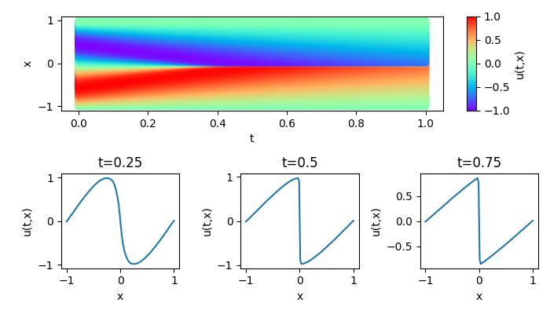

# 一维Burgers问题

## 概述

伯格斯方程（Burgers' equation）是一个模拟冲击波的传播和反射的非线性偏微分方程，被广泛应用于流体力学，非线性声学，气体动力学等领域，它以约翰内斯·马丁斯汉堡（1895-1981）的名字命名。本案例采用MindFlow流体仿真套件，基于物理驱动的PINNs (Physics Informed Neural Networks)方法，求解一维有粘性情况下的Burgers方程。

## 快速开始

### 训练方式：在命令行中调用`train.py`脚本

```shell
python train.py
```


## 结果展示



