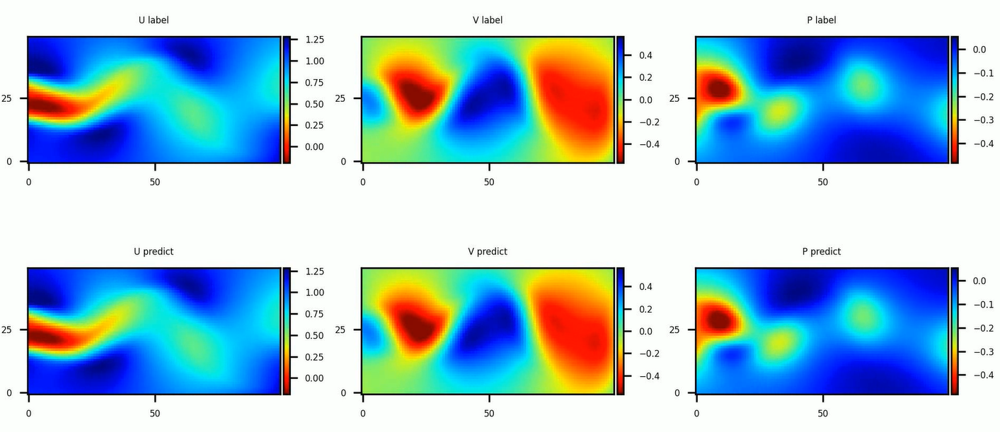
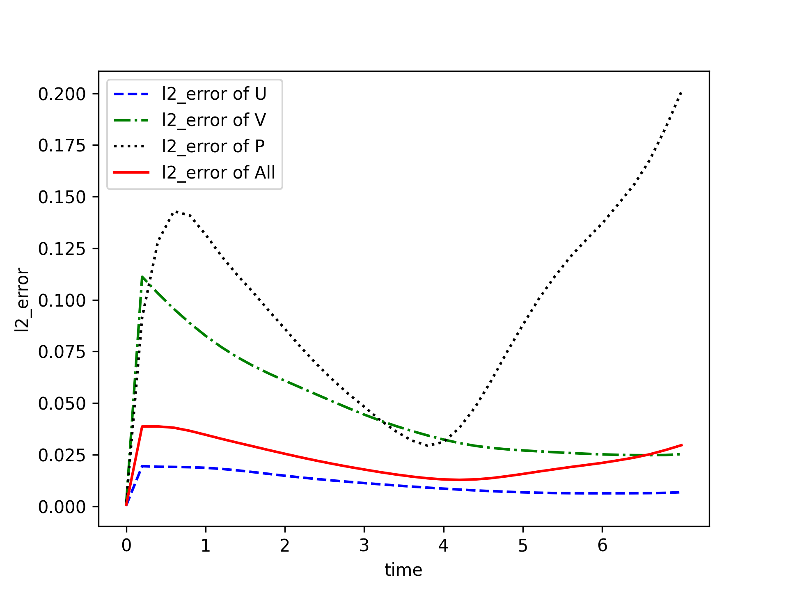

# 二维圆柱绕流

## 概述

## 问题描述

圆柱绕流，即二维圆柱低速非定常绕流，流动特性与雷诺数`Re`有关。。在`Re`≤1 时，流场中的惯性力与粘性力相比居次要地位，圆柱上下游的流线前后对称，阻力系数近似与`Re`成反比，此`Re`数范围的绕流称为斯托克斯区；随着 Re 的增大，圆柱上下游的流线逐渐失去对称性。这种特殊的现象反映了流体与物体表面相互作用的奇特本质，求解圆柱绕流则是流体力学中的经典问题。本案例利用 PINNs 求解圆柱绕流的尾流流场。

### 技术路径

纳维-斯托克斯方程（Navier-Stokes equation），简称`N-S`方程，是流体力学领域的经典偏微分方程，在粘性不可压缩情况下，无量纲`N-S`方程的形式如下：

$$
\frac{\partial u}{\partial x} + \frac{\partial v}{\partial y} = 0
$$

$$
\frac{\partial u} {\partial t} + u \frac{\partial u}{\partial x} + v \frac{\partial u}{\partial y} = - \frac{\partial p}{\partial x} + \frac{1} {Re} (\frac{\partial^2u}{\partial x^2} + \frac{\partial^2u}{\partial y^2})
$$

$$
\frac{\partial v} {\partial t} + u \frac{\partial v}{\partial x} + v \frac{\partial v}{\partial y} = - \frac{\partial p}{\partial y} + \frac{1} {Re} (\frac{\partial^2v}{\partial x^2} + \frac{\partial^2v}{\partial y^2})
$$

其中，`Re`表示雷诺数。

本案例利用 PINNs 方法学习位置和时间到相应流场物理量的映射，实现`N-S`方程的求解：

$$
(x, y, t) \mapsto (u, v, p)
$$

## 快速开始

```shell
python train.py
```


## 结果展示






