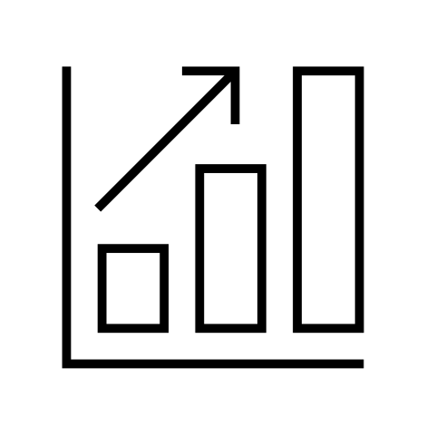
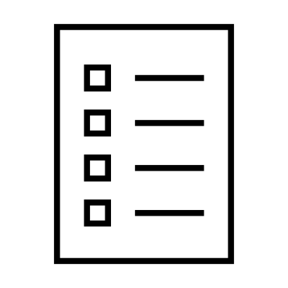
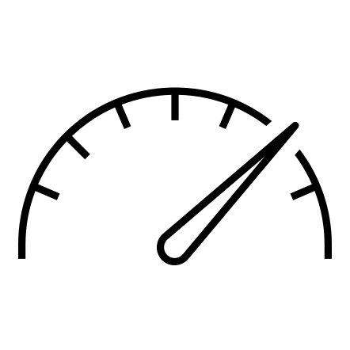

# NVIDIA PhysicsNeMo

<!-- markdownlint-disable -->

📝 NVIDIA PhysicsNeMo is undergoing an update to v2.0 - all the features, with easier installation and integration to external packages.  See the [migration guide](https://github.com/NVIDIA/physicsnemo/blob/main/v2.0-MIGRATION-GUIDE.md) for more details!

[](https://www.repostatus.org/#active)
[](https://github.com/NVIDIA/physicsnemo/blob/master/LICENSE.txt)
[](https://github.com/psf/black)
[](https://github.com/NVIDIA/physicsnemo/actions/workflows/install-ci.yml)

<!-- markdownlint-enable -->
[**NVIDIA PhysicsNeMo**](#what-is-physicsnemo)
| [**Documentation**](https://docs.nvidia.com/deeplearning/physicsnemo/physicsnemo-core/index.html)
| [**Install Guide**](#installation)
| [**Getting Started**](#getting-started-with-physicsnemo)
| [**Contributing Guidelines**](#contributing-to-physicsnemo)
| [**Dev blog**](https://nvidia.github.io/physicsnemo/blog/)

## What is PhysicsNeMo?

NVIDIA PhysicsNeMo is an open-source deep-learning framework for building, training,
fine-tuning, and inferring Physics AI models using state-of-the-art SciML methods for
AI4Science and engineering.

PhysicsNeMo provides Python modules to compose scalable and optimized training and
inference pipelines to explore, develop, validate, and deploy AI models that combine
physics knowledge with data, enabling real-time predictions.

Whether you are exploring the use of neural operators, GNNs, or transformers, or are
interested in Physics-Informed Neural Networks or a hybrid approach in between, PhysicsNeMo
provides you with an optimized stack that will enable you to train your models at scale.

<!-- markdownlint-disable -->
<p align="center">
  
</p>
<!-- markdownlint-enable -->

<!-- toc -->

- [More About PhysicsNeMo](#more-about-physicsnemo)
  - [Scalable GPU-Optimized Training Library](#scalable-gpu-optimized-training-library)
  - [A Suite of Physics-Informed ML Models](#a-suite-of-physics-informed-ml-models)
  - [Seamless PyTorch Integration](#seamless-pytorch-integration)
  - [Easy Customization and Extension](#easy-customization-and-extension)
  - [AI4Science Library](#ai4science-library)
    - [Domain-Specific Packages](#domain-specific-packages)
- [Who is Using and Contributing to PhysicsNeMo](#who-is-using-and-contributing-to-physicsnemo)
- [Why Use PhysicsNeMo](#why-are-they-using-physicsnemo)
- [Getting Started](#getting-started-with-physicsnemo)
- [Resources](#resources)
- [Installation](#installation)
- [Contributing](#contributing-to-physicsnemo)
- [Communication](#communication)
- [License](#license)

<!-- tocstop -->

## More About PhysicsNeMo

At a granular level, PhysicsNeMo is developed as modular functionality and therefore
provides built-in composable modules that are packaged into a few key components:

<!-- markdownlint-disable -->
Component | Description |
---- | --- |
[**physicsnemo.models**](https://docs.nvidia.com/physicsnemo/latest/user-guide/model_architectures.html) ( [More Details](https://docs.nvidia.com/physicsnemo/latest/physicsnemo/api_models.html)) | A collection of optimized, customizable, and easy-to-use families of model architectures such as Neural Operators, Graph Neural Networks, Diffusion models, Transformer models, and many more|
[**physicsnemo.datapipes**](https://docs.nvidia.com/deeplearning/physicsnemo/physicsnemo-core/api/physicsnemo.datapipes.html) | Optimized and scalable built-in data pipelines fine-tuned to handle engineering and scientific data structures like point clouds, meshes, etc.|
[**physicsnemo.distributed**](https://docs.nvidia.com/deeplearning/physicsnemo/physicsnemo-core/api/physicsnemo.distributed.html) | A distributed computing sub-module built on top of `torch.distributed` to enable parallel training with just a few steps|
[**physicsnemo.curator**](https://github.com/NVIDIA/physicsnemo-curator) | A sub-module to streamline and accelerate the process of data curation for engineering datasets|
[**physicsnemo.sym**](docs/api/physicsnemo.sym.rst) | Symbolic PDE residual computation — define equations via SymPy and compute physics-informed losses with automatic spatial derivatives (install with `pip install "nvidia-physicsnemo[sym]"`)|
<!-- markdownlint-enable -->

For a complete list, refer to the PhysicsNeMo API documentation for
[PhysicsNeMo](https://docs.nvidia.com/deeplearning/physicsnemo/physicsnemo-core/index.html).

## AI4Science Library

Usually, PhysicsNeMo is used either as:

- A complementary tool to PyTorch when exploring AI for SciML and AI4Science applications.
- A deep learning research platform that provides scale and optimal performance on
NVIDIA GPUs.

### Domain-Specific Packages

The following are packages dedicated to domain experts of specific communities, catering
to their unique exploration needs:

- [PhysicsNeMo CFD](https://github.com/NVIDIA/physicsnemo-cfd): Inference sub-module of PhysicsNeMo
  to enable CFD domain experts to explore, experiment, and validate using pretrained
  AI models for CFD use cases.
- [PhysicsNeMo Curator](https://github.com/NVIDIA/physicsnemo-curator): Inference sub-module
  of PhysicsNeMo to streamline and accelerate the process of data curation for engineering
  datasets.
- [Earth-2 Studio](https://github.com/NVIDIA/earth2studio): Inference sub-module of PhysicsNeMo
  to enable climate researchers and scientists to explore and experiment with pretrained
  AI models for weather and climate.

### Scalable GPU-Optimized Training Library

PhysicsNeMo provides a highly optimized and scalable training library for maximizing the
power of NVIDIA GPUs.
[Distributed computing](https://docs.nvidia.com/deeplearning/physicsnemo/physicsnemo-core/api/physicsnemo.distributed.html)
utilities allow for efficient scaling from a single GPU to multi-node GPU clusters with
a few lines of code, ensuring that large-scale
physics-informed machine learning (ML) models can be trained quickly and effectively.
The framework includes support for advanced
[optimization utilities](https://docs.nvidia.com/deeplearning/physicsnemo/physicsnemo-core/api/physicsnemo.utils.html#module-physicsnemo.utils.capture),
[tailor-made datapipes](https://docs.nvidia.com/deeplearning/physicsnemo/physicsnemo-core/api/physicsnemo.datapipes.html),
and [symbolic PDE utilities](physicsnemo/sym/)
to enhance end-to-end training speed.

### A Suite of Physics-Informed ML Models

PhysicsNeMo offers a library of state-of-the-art models specifically designed
for Physics-ML applications. Users can build any model architecture by using the underlying
PyTorch layers and combining them with curated PhysicsNeMo layers.

The [Model Zoo](https://docs.nvidia.com/physicsnemo/latest/user-guide/model_architectures.html)
includes optimized implementations of families of model architectures such as
Neural Operators:

- [Fourier Neural Operators (FNOs)](physicsnemo/models/fno)
- [DeepONet](examples/cfd/darcy_physics_informed/)
- [DoMINO](https://docs.nvidia.com/deeplearning/physicsnemo/physicsnemo-core/examples/cfd/external_aerodynamics/domino/readme.html)
- [Graph Neural Networks (GNNs)](physicsnemo/nn/module/gnn_layers)
- [MeshGraphNet](https://github.com/NVIDIA/physicsnemo/tree/main/examples/cfd/vortex_shedding_mgn)
- [MeshGraphNet for Lagrangian](https://github.com/NVIDIA/physicsnemo/tree/main/examples/cfd/lagrangian_mgn)
- [XAeroNet](https://github.com/NVIDIA/physicsnemo/tree/main/examples/cfd/external_aerodynamics/xaeronet)
- [Diffusion Models](physicsnemo/models/diffusion)
- [Correction Diffusion Model](https://github.com/NVIDIA/physicsnemo/tree/main/examples/weather/corrdiff)
- [DDPM](https://github.com/NVIDIA/physicsnemo/tree/main/examples/cfd/flow_reconstruction_diffusion)
- [PhysicsNeMo GraphCast](https://github.com/NVIDIA/physicsnemo/tree/main/examples/weather/graphcast)
- [Transsolver](https://github.com/NVIDIA/physicsnemo/tree/main/examples/cfd/darcy_transolver)
- [RNNs](https://github.com/NVIDIA/physicsnemo/tree/main/physicsnemo/models)
- [SwinVRNN](https://github.com/NVIDIA/physicsnemo/tree/main/physicsnemo/models/swinvrnn)
- [Physics-Informed Neural Networks (PINNs)](examples/cfd/ldc_pinns/)

And many others.

These models are optimized for various physics domains, such as computational fluid
dynamics, structural mechanics, and electromagnetics. Users can download, customize, and
build upon these models to suit their specific needs, significantly reducing the time
required to develop high-fidelity simulations.

### Seamless PyTorch Integration

PhysicsNeMo is built on top of PyTorch, providing a familiar and user-friendly experience
for those already proficient with PyTorch.
This includes a simple Python interface and modular design, making it easy to use
PhysicsNeMo with existing PyTorch workflows.
Users can leverage the extensive PyTorch ecosystem, including its libraries and tools,
while benefiting from PhysicsNeMo's specialized capabilities for physics-ML. This seamless
integration ensures users can quickly adopt PhysicsNeMo without a steep learning curve.

For more information, refer to [Converting PyTorch Models to PhysicsNeMo Models](https://docs.nvidia.com/deeplearning/physicsnemo/physicsnemo-core/api/physicsnemo.models.html#converting-pytorch-models-to-physicsnemo-models).

### Easy Customization and Extension

PhysicsNeMo is designed to be highly extensible, allowing users to add new functionality
with minimal effort. The framework provides Pythonic APIs for
defining new physics models, geometries, and constraints, making it easy to extend its
capabilities to new use cases.
The adaptability of PhysicsNeMo is further enhanced by key features such as
[ONNX support](https://docs.nvidia.com/deeplearning/physicsnemo/physicsnemo-core/api/physicsnemo.deploy.html)
for flexible model deployment,
robust [logging utilities](https://docs.nvidia.com/deeplearning/physicsnemo/physicsnemo-core/api/physicsnemo.launch.logging.html)
for streamlined error handling,
and efficient
[checkpointing](https://docs.nvidia.com/deeplearning/physicsnemo/physicsnemo-core/api/physicsnemo.launch.utils.html#module-physicsnemo.launch.utils.checkpoint)
to simplify model loading and saving.

This extensibility ensures that PhysicsNeMo can adapt to the evolving needs of researchers
and engineers, facilitating the development of innovative solutions in the field of physics-ML.

Detailed information on features and capabilities can be found in the [PhysicsNeMo documentation](https://docs.nvidia.com/physicsnemo/index.html#core).

[Reference samples](examples/README.md) cover a broad spectrum of physics-constrained
and data-driven
workflows to suit the diversity of use cases in the science and engineering disciplines.

> [!TIP]
> Have questions about how PhysicsNeMo can assist you? Try our [Experimental] chatbot,
> [PhysicsNeMo Guide](https://chatgpt.com/g/g-PXrBv20SC-modulus-guide), for answers.

### Hello World

You can start using PhysicsNeMo in your PyTorch code as simply as shown here:

```python
>>> import torch
>>> from physicsnemo.models.mlp.fully_connected import FullyConnected
>>> model = FullyConnected(in_features=32, out_features=64)
>>> input = torch.randn(128, 32)
>>> output = model(input)
>>> output.shape
torch.Size([128, 64])
```

To use the distributed module, you can do the following (example for
distributed data parallel training; for a more in-depth tutorial, refer to
[PhysicsNeMo Distributed](https://docs.nvidia.com/deeplearning/physicsnemo/physicsnemo-core/api/physicsnemo.distributed.html#)):

```python
import torch
from torch.nn.parallel import DistributedDataParallel
from physicsnemo.distributed import DistributedManager
from physicsnemo.models.mlp.fully_connected import FullyConnected

def main():
    DistributedManager.initialize()
    dist = DistributedManager()

    arch = FullyConnected(in_features=32, out_features=64).to(dist.device)

    if dist.distributed:
        ddps = torch.cuda.Stream()
        with torch.cuda.stream(ddps):
            arch = DistributedDataParallel(
                arch,
                device_ids=[dist.local_rank],
                output_device=dist.device,
                broadcast_buffers=dist.broadcast_buffers,
                find_unused_parameters=dist.find_unused_parameters,
            )
        torch.cuda.current_stream().wait_stream(ddps)

    # Set up the optimizer
    optimizer = torch.optim.Adam(
        arch.parameters(),
        lr=0.001,
    )

    def training_step(invar, target):
        pred = arch(invar)
        loss = torch.sum(torch.pow(pred - target, 2))
        loss.backward()
        optimizer.step()
        return loss

    # Sample training loop
    for i in range(20):
        # Random inputs and targets for simplicity
        input = torch.randn(128, 32, device=dist.device)
        target = torch.randn(128, 64, device=dist.device)

        # Training step
        loss = training_step(input, target)

if __name__ == "__main__":
    main()
```

To use the PDE module, you can do the following:

```python
>>> from physicsnemo.sym.eq.pdes.navier_stokes import NavierStokes
>>> ns = NavierStokes(nu=0.01, rho=1, dim=2)
>>> ns.pprint()
continuity: u__x + v__y
momentum_x: u*u__x + v*u__y + p__x + u__t - 0.01*u__x__x - 0.01*u__y__y
momentum_y: u*v__x + v*v__y + p__y + v__t - 0.01*v__x__x - 0.01*v__y__y
```

## Who is Using and Contributing to PhysicsNeMo

PhysicsNeMo is an open-source project and gets contributions from researchers in
the SciML and AI4Science fields. While the PhysicsNeMo team works on optimizing the
underlying software stack, the community collaborates and contributes model architectures,
datasets, and reference applications so we can innovate in the pursuit of
developing generalizable model architectures and algorithms.

Some recent examples of community contributors are the [HP Labs 3D Printing team](https://developer.nvidia.com/blog/spotlight-hp-3d-printing-and-nvidia-physicsnemo-collaborate-on-open-source-manufacturing-digital-twin/),
[Stanford Cardiovascular research team](https://developer.nvidia.com/blog/enabling-greater-patient-specific-cardiovascular-care-with-ai-surrogates/),
[UIUC team](https://github.com/NVIDIA/physicsnemo/tree/main/examples/cfd/mhd_pino),
[CMU team](https://github.com/NVIDIA/physicsnemo/tree/main/examples/generative/diffusion),
etc.

Recent examples of research teams using PhysicsNeMo are the
[ORNL team](https://arxiv.org/abs/2404.05768),
[TU Munich CFD team](https://www.nvidia.com/en-us/on-demand/session/gtc24-s62237/), etc.

Please navigate to this page for a complete list of research work leveraging PhysicsNeMo.
For a list of enterprises using PhysicsNeMo, refer to the [PhysicsNeMo Webpage](https://developer.nvidia.com/physicsnemo).

Using PhysicsNeMo and interested in showcasing your work on
[NVIDIA Blogs](https://developer.nvidia.com/blog/category/simulation-modeling-design/)?
Fill out this [proposal form](https://forms.gle/XsBdWp3ji67yZAUF7) and we will get back
to you!

## Why Are They Using PhysicsNeMo

Here are some of the key benefits of PhysicsNeMo for SciML model development:

<!-- markdownlint-disable -->
 |  | 
---|---|---|
|SciML Benchmarking and Validation|Ease of Using Generalized SciML Recipes with Heterogeneous Datasets |Out-of-the-Box Performance and Scalability
|PhysicsNeMo enables researchers to benchmark their AI models against proven architectures for standard benchmark problems with detailed domain-specific validation criteria.|PhysicsNeMo enables researchers to pick from state-of-the-art SciML architectures and use built-in data pipelines for their use case.| PhysicsNeMo provides out-of-the-box performant training pipelines, including optimized ETL pipelines for heterogeneous engineering and scientific datasets and out-of-the-box scaling across multi-GPU and multi-node GPUs.
<!-- markdownlint-enable -->

See what your peer SciML researchers are saying about PhysicsNeMo (coming soon).

## Getting Started with PhysicsNeMo

The following resources will help you learn how to use PhysicsNeMo. The best
way is to start with a reference sample and then update it for your own use case.

- [Using PhysicsNeMo with your PyTorch model](https://docs.nvidia.com/deeplearning/physicsnemo/physicsnemo-core/tutorials/simple_training_example.html#using-custom-models-in-physicsnemo)
- [Using PhysicsNeMo built-in models](https://docs.nvidia.com/deeplearning/physicsnemo/physicsnemo-core/tutorials/simple_training_example.html#using-built-in-models)
- [Getting Started Guide](https://docs.nvidia.com/deeplearning/physicsnemo/getting-started/index.html)
- [Reference Samples](https://github.com/NVIDIA/physicsnemo/blob/main/examples/README.md)
- [User Guide Documentation](https://docs.nvidia.com/deeplearning/physicsnemo/physicsnemo-core/index.html)

## Learning AI Physics

- [Explore Jupyter Notebooks on Hugging Face](https://huggingface.co/collections/nvidia/physicsnemo)
- [AI4Science PhysicsNeMo Bootcamp](https://github.com/openhackathons-org/End-to-End-AI-for-Science)
- [Self-Paced DLI Training](https://learn.nvidia.com/courses/course-detail?course_id=course-v1:DLI+S-OV-04+V1)
- [Deep Learning for Science and Engineering Lecture Series](https://www.nvidia.com/en-us/on-demand/deep-learning-for-science-and-engineering/)
- [Video Tutorials](https://www.nvidia.com/en-us/on-demand/search/?facet.mimetype[]=event%20session&layout=list&page=1&q=physicsnemo&sort=relevance&sortDir=desc)

## Resources

- [Getting Started Webinar](https://www.nvidia.com/en-us/on-demand/session/gtc24-dlit61460/?playlistId=playList-bd07f4dc-1397-4783-a959-65cec79aa985)
- [PhysicsNeMo: Purpose and Usage](https://www.nvidia.com/en-us/on-demand/session/dliteachingkit-setk5002/)
- [AI4Science PhysicsNeMo Bootcamp](https://github.com/openhackathons-org/End-to-End-AI-for-Science)
- [PhysicsNeMo Pretrained Models](https://catalog.ngc.nvidia.com/models?filters=&orderBy=scoreDESC&query=PhysicsNeMo&page=&pageSize=)
- [PhysicsNeMo Datasets and Supplementary Materials](https://catalog.ngc.nvidia.com/resources?filters=&orderBy=scoreDESC&query=PhysicsNeMo&page=&pageSize=)

## Installation

You can install PhysicsNeMo in two supported ways: **via pip** (native pip or
**uv**) or by using the **NVIDIA container image**. Choose the method that fits your
environment and workflow.

The following instructions cover the base PhysicsNeMo modules. Optional dependencies
are listed in [`pyproject.toml`](./pyproject.toml). The [training recipes](./examples)
are not bundled in the pip wheels or container; clone the repo and use the examples
as a starting point. Many examples have a `requirements.txt` for extra dependencies.

### CUDA Backend Selection

> **Important:** To get GPU-accelerated RAPIDS packages (cuML, pylibraft, cupy)
> and a CUDA-matched PyTorch build, you **must** include either `cu13` or `cu12`
> when installing. Feature extras like `nn-extras` and `utils-extras` provide
> additional non-CUDA packages (scipy, natten, wandb, etc.) but do not include
> RAPIDS dependencies on their own.

PhysicsNeMo supports both CUDA 12 and CUDA 13 backends. The backend is selected
via an extra that is orthogonal to the feature extras - combine them freely:

| Extra | What it provides |
| --- | --- |
| `cu13` | PyTorch (CUDA 13.0), cuML-cu13, pylibraft-cu13, cupy-cuda13x |
| `cu12` | PyTorch (CUDA 12.8), cuML-cu12, pylibraft-cu12, cupy-cuda12x |
| *(neither)* | PyTorch from PyPI (default build), **no RAPIDS packages** |

### PyPI

Install the latest version from PyPI:

```Bash
pip install nvidia-physicsnemo
python -c "import physicsnemo; print('PhysicsNeMo version:', physicsnemo.__version__)"
```

To install with a specific CUDA backend and optional feature extras:

```Bash
# CUDA 13 backend with nn-extras
pip install "nvidia-physicsnemo[cu13,nn-extras]"

# CUDA 12 backend with nn-extras
pip install "nvidia-physicsnemo[cu12,nn-extras]"
```

Other feature extras (`utils-extras`, `mesh-extras`, `model-extras`,
`datapipes-extras`, `gnns`) can be combined in the same way.

The installation can also be verified by running the [Hello World](#hello-world) example.

### uv

For development or to run examples from source, you can use [uv](https://docs.astral.sh/uv/)
to clone the repository and sync dependencies:

```Bash
git clone https://github.com/NVIDIA/physicsnemo.git
cd physicsnemo
uv sync --extra cu13
uv run python -c "import physicsnemo; print('PhysicsNeMo version:', physicsnemo.__version__)"
```

To install with optional feature extras (e.g., `nn-extras`):

```Bash
uv sync --extra cu13 --extra nn-extras
```

For a CUDA 12 environment, replace `cu13` with `cu12`:

```Bash
uv sync --extra cu12 --extra nn-extras
```

### NVCR Container

The PhysicsNeMo Docker image can be pulled from the
[NVIDIA Container Registry](https://catalog.ngc.nvidia.com/orgs/nvidia/teams/physicsnemo/containers/physicsnemo)
(refer to the NGC registry for the latest tag):

```Bash
docker pull nvcr.io/nvidia/physicsnemo/physicsnemo:25.06
```

Inside the container, you can clone the PhysicsNeMo git repositories and get
started with the examples. The command below shows the instructions to launch
the PhysicsNeMo container and run examples from this repo:

```bash
docker run --shm-size=1g --ulimit memlock=-1 --ulimit stack=67108864 --runtime nvidia \
--rm -it nvcr.io/nvidia/physicsnemo/physicsnemo:25.06 bash
git clone https://github.com/NVIDIA/physicsnemo.git
cd physicsnemo/examples/cfd/darcy_fno/
pip install warp-lang # install NVIDIA Warp to run the Darcy example
python train_fno_darcy.py
```

### From Source

For a local build of the PhysicsNeMo Python package from source, use:

```Bash
git clone git@github.com:NVIDIA/physicsnemo.git && cd physicsnemo

pip install --upgrade pip
pip install .
python -c "import physicsnemo; print('PhysicsNeMo version:', physicsnemo.__version__)"
```

For editable installs, testing your changes locally, and contribution workflows,
see the [Customizing PhysicsNeMo](https://docs.nvidia.com/physicsnemo/latest/resources/customization_guide.html)
guide in the documentation. See also the [contributing guidelines](CONTRIBUTING.md)
for pull requests, coding style, and CI, and the
[developer wiki](https://github.com/NVIDIA/physicsnemo/wiki) for community and
contributing overview.

### Building Docker from Source

To build the PhysicsNeMo Docker image:

```bash
docker build -t physicsnemo:deploy \
    --build-arg TARGETPLATFORM=linux/amd64 --target deploy -f Dockerfile .
```

Alternatively, you can run `make container-deploy`.

To build the CI image:

```bash
docker build -t physicsnemo:ci \
    --build-arg TARGETPLATFORM=linux/amd64 --target ci -f Dockerfile .
```

Alternatively, you can run `make container-ci`.

### Platform Support

For pip or uv installation, Linux, macOS (ARM), and Windows are supported.

Docker containers are available for `linux/amd64` and `linux/arm64` platforms only.
If using `linux/arm64`, some dependencies like `warp-lang` might not install correctly.

## PhysicsNeMo Migration Guide

NVIDIA Modulus has been renamed to NVIDIA PhysicsNeMo. For migration:

- Use `pip install nvidia-physicsnemo` rather than `pip install nvidia-modulus`
  for PyPI wheels.
- Use `nvcr.io/nvidia/physicsnemo/physicsnemo:<tag>` rather than
  `nvcr.io/nvidia/modulus/modulus:<tag>` for Docker containers.
- Replace `nvidia-modulus` with `nvidia-physicsnemo` in your pip requirements
  files (`requirements.txt`, `setup.py`, `setup.cfg`, `pyproject.toml`, etc.).
- In your code, change the import statements from `import modulus` to
  `import physicsnemo`.

The old PyPI registry and the NGC container registry will be deprecated soon
and will not receive any bug fixes/updates. The old checkpoints will remain
compatible with these updates.

More details to follow soon.

## DGL to PyTorch Geometric Migration Guide

PhysicsNeMo supports a wide range of Graph Neural Networks (GNNs),
including MeshGraphNet and others.
Currently, PhysicsNeMo uses the DGL library as its GNN backend,
with plans to completely transition to PyTorch Geometric (PyG) in a future release.
For more details, please refer to the [DGL-to-PyG migration guide](https://github.com/NVIDIA/physicsnemo/blob/main/examples/dgl_to_pyg_migration.md).

## Contributing to PhysicsNeMo

PhysicsNeMo is an open-source collaboration, and its success is rooted in community
contributions to further the field of Physics-ML. Thank you for contributing to the
project so others can build on top of your contributions.

For guidance on contributing to PhysicsNeMo, see the [contributing guidelines](CONTRIBUTING.md)
(pull requests, coding style, CI).
For install-from-source steps, editable installs, and testing your changes, see
the [Customizing PhysicsNeMo](https://docs.nvidia.com/physicsnemo/latest/resources/customization_guide.html)
guide in the documentation. For community and contributing overview, see the
[developer wiki](https://github.com/NVIDIA/physicsnemo/wiki).

## Cite PhysicsNeMo

If PhysicsNeMo helped your research and you would like to cite it, please refer to the [guidelines](https://github.com/NVIDIA/physicsnemo/blob/main/CITATION.cff).

If your work uses the domain parallelism components in PhysicsNeMo (e.g. `ShardTensor`),
please consider citing:

```bibtex
@misc{pnm2026shardtensor,
      title={ShardTensor: Domain Parallelism for Scientific Machine Learning},
      author={Corey Adams
              and Peter Harrington
              and Akshay Subramaniam
              and Mohammad Shoaib Abbas
              and Jaideep Pathak
              and Mike Pritchard
              and Sanjay Choudhry},
      year={2026},
      eprint={2605.11111},
      archivePrefix={arXiv},
      primaryClass={cs.DC},
      url={https://arxiv.org/abs/2605.11111},
}
```

## Communication

- GitHub Discussions: Discuss new architectures, implementations, Physics-ML research, etc.
- GitHub Issues: Bug reports, feature requests, install issues, etc.
- PhysicsNeMo Forum: The [PhysicsNeMo Forum](https://forums.developer.nvidia.com/t/welcome-to-the-physicsnemo-ml-model-framework-forum/178556)
hosts an audience of new to moderate-level users and developers for general chat, online
discussions, collaboration, etc.

## Feedback

Want to suggest some improvements to PhysicsNeMo? Use our [feedback form](https://docs.google.com/forms/d/e/1FAIpQLSfX4zZ0Lp7MMxzi3xqvzX4IQDdWbkNh5H_a_clzIhclE2oSBQ/viewform?usp=sf_link).

## License

PhysicsNeMo is provided under the Apache License 2.0. Please see [LICENSE.txt](./LICENSE.txt)
for the full license text. Enterprise SLA, support, and preview access are available
under NVAIE.
