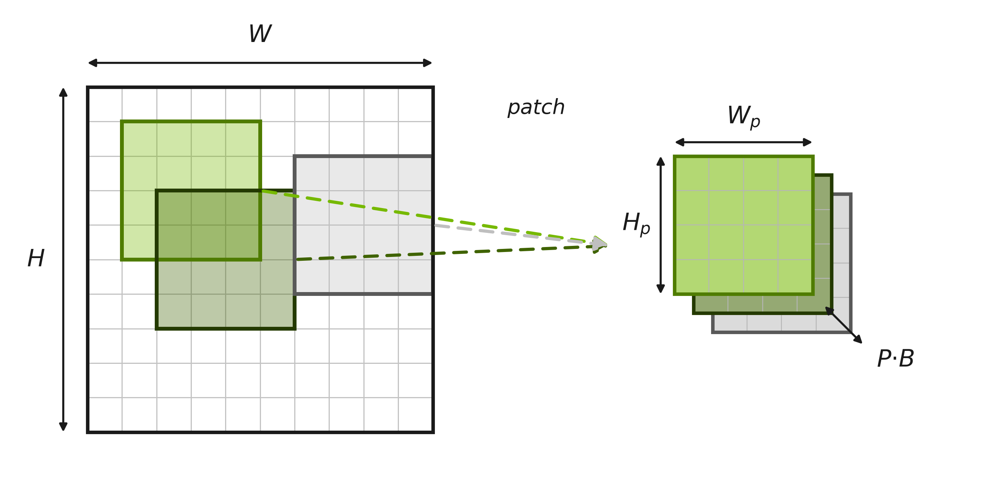
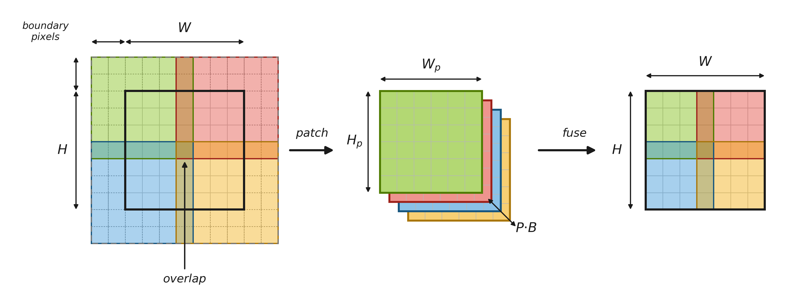
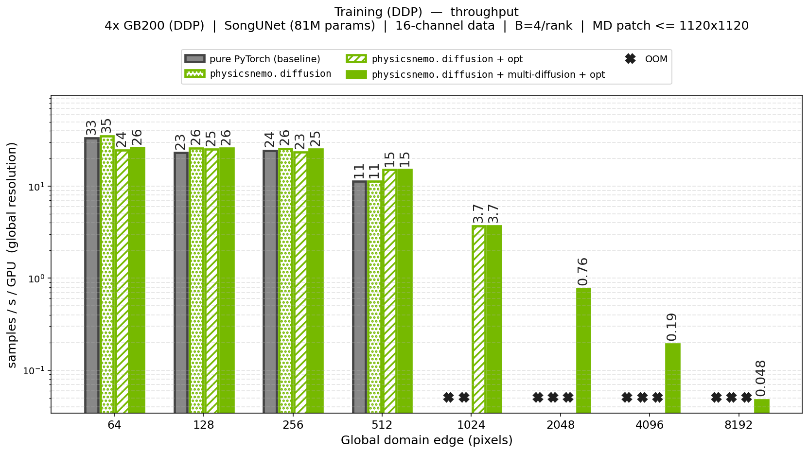
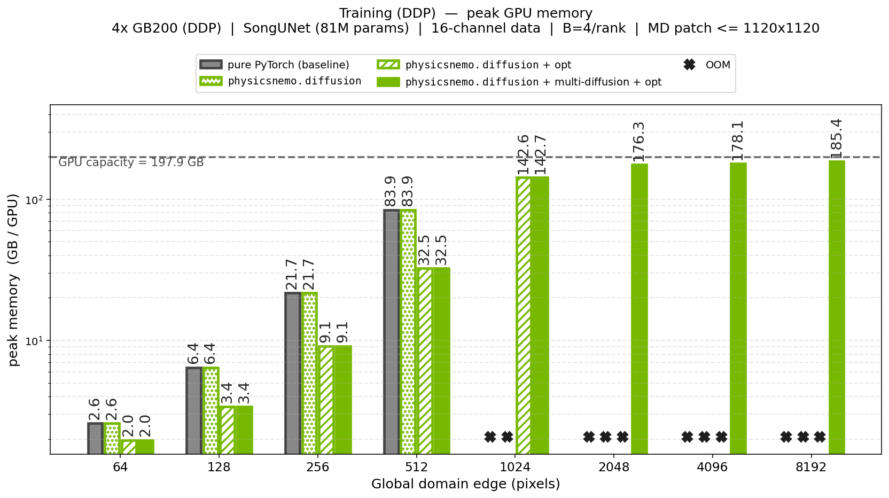
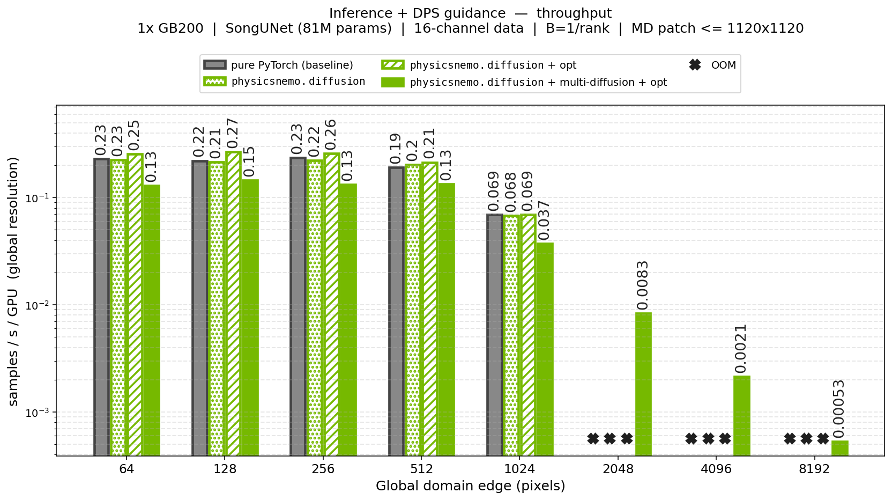
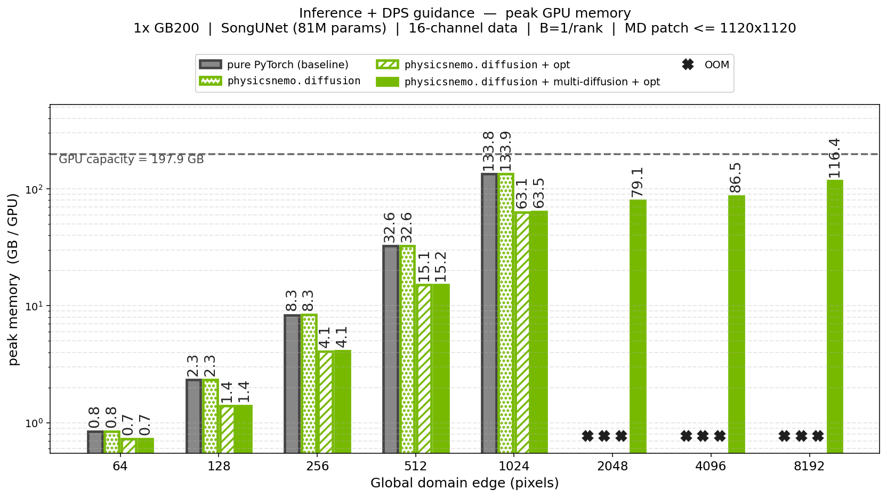

.. _diffusion_multi_diffusion:

Multi-Diffusion
===============

.. currentmodule:: physicsnemo.diffusion.multi_diffusion

Multi-diffusion is a technique for scaling diffusion models to spatial domains
that are too large to be processed in a single pass. Such large domains are
common in the physics-AI and scientific machine learning applications targeted
by the PhysicsNeMo diffusion module. The full domain is split into smaller
patches, the diffusion model is run on each patch, and, when necessary, the
patches are fused back into a single, globally coherent result. It is used
whenever training or sampling on the full domain, whichever has the higher peak
memory, would exceed the available GPU memory. The approach follows that
introduced in `MultiDiffusion: Fusing Diffusion Paths for Controlled Image
Generation <https://arxiv.org/abs/2302.08113>`_ (Bar-Tal et al., 2023).

Multi-diffusion does not reduce the total amount of computation: apart from the
patching, fusing, and optional positional-embedding and conditioning
operations, the model performs essentially the same work as a full-domain pass.
What changes is how that work is mapped onto the GPU:

* **Training** (through :class:`MultiDiffusionModel2D` and the
  :ref:`multi-diffusion losses <diffusion_multi_diffusion_losses>`): small
  patches are extracted from the global sample (they need not cover all of it)
  and treated as independent batch elements, each noised and denoised on its
  own.  The objective is the ordinary batched denoising loss
  over the resulting :math:`P \times B` patches, an embarrassingly parallel
  computation.  There is **no fusion step**, reassembling a full-resolution
  output is only required at inference.  Peak memory is set by the patch size
  and the number of patches processed per step, not by the global domain size
  (illustrated in :ref:`the training schematic <md_schematic_training>`).
* **Inference** (through :class:`MultiDiffusionPredictor`): the global noisy
  state is tiled into a deterministic grid of patches, each patch is denoised,
  and at every solver step the per-patch estimates are **fused** (overlapping
  regions averaged) back into a single global state before the next step. The
  patches are processed with reduced parallelism, sequentially or in small
  chunks, so peak memory is set by the patch size and chunk size rather than
  the global domain size (illustrated in :ref:`the inference schematic
  <md_schematic_inference>`).

In both cases this trades GPU parallelism (and therefore throughput) for the
ability to run on domains that would otherwise exhaust memory.

.. _md_schematic_training:

   Training. Patches are extracted from the global tensor at random positions
   (they need not cover all of it) and denoised independently as batch
   elements.  No fusion is performed.

.. _md_schematic_inference:

   Inference.  The global tensor is tiled into an overlapping grid of patches
   over a ``boundary_pix`` reflection-padded margin (cropped on fusion);
   neighbors share ``overlap_pix`` pixels.  The per-patch outputs are fused back
   into a full-resolution result (overlaps averaged) at every solver step.

The multi-diffusion utilities documented here form a small, opt-in toolkit
layered on top of the rest of the :ref:`diffusion module
<diffusion_introduction>`. The other
components of the diffusion module, the :ref:`noise schedulers
<diffusion_noise_schedulers>`, the :ref:`samplers and solvers
<diffusion_samplers>`, and the :ref:`preconditioners
<diffusion_preconditioners>`, are fully compatible with the multi-diffusion
abstractions and can be used without modification.  Unlike most of the framework,
which exposes multiple :ref:`customization tiers <diffusion_introduction>`
(protocol, abstract base class, concrete implementation), the multi-diffusion
abstractions are deliberately shipped as concrete, ready-to-use wrappers. Each
one is a specialized version of a generic counterpart and favors a small amount
of code over maximal flexibility.  For finer-grained control, the
:ref:`patching utilities <diffusion_multi_diffusion_patching>` can be applied
directly to custom tensors to implement bespoke patching logic.

Performance
-----------

Multi-diffusion trades GPU parallelism for memory: processing the patches with
reduced parallelism lowers throughput, but peak memory stays bounded, so the
same pipeline scales to global domains it could otherwise never fit.  Combined
with the framework's built-in optimizations (``torch.compile``, AMP-bf16, and
Apex layers), it scales both training and guided generation to domains with up
to 64x more pixels than the same pipeline without it.  This brings diffusion
within reach of the very large scientific domains (weather, CFD, and the like)
whose grids run into billions of points, far beyond what a single GPU could
hold.  The benchmarks below report throughput and peak GPU memory as a function
of the global domain size (pixels per edge).

   Training throughput (samples/s/GPU; 4x GB200 with DDP, an 81M-parameter
   diffusion U-Net on 16-channel data) versus global domain size.  At 512x512
   the built-in optimizations (``torch.compile``, AMP-bf16, Apex layers) reach
   1.4x the throughput of a pure-PyTorch baseline and run up to 1024x1024, where
   the baseline runs out of memory.  Beyond that, only multi-diffusion keeps
   running: it lowers throughput but scales training to domains with up to 64x
   more pixels than the baseline can fit.

   Training peak GPU memory versus global domain size.  The full-domain
   footprint grows with the domain and reaches OOM, whereas multi-diffusion
   keeps peak memory bounded (set by the patch and chunk sizes), so training
   continues well past the baseline's limit.

   Guided-sampling (DPS) throughput on a single GB200.  The built-in
   optimizations (AMP-bf16, ``torch.compile``, Apex layers) raise generation
   throughput by roughly 20-30% below 256x256; on top of that, multi-diffusion
   scales guided sampling to domains 64x larger in pixels, the regime that makes
   DPS-guided generation on large scientific domains practical.

   Guided-sampling (DPS) peak GPU memory versus global domain size.
   Differentiating the guidance through the model makes the full-domain
   footprint especially large; chunked, gradient-checkpointed multi-diffusion
   keeps it bounded and scales guided sampling far beyond the baseline.

Training
--------

Patch-based training is driven by :class:`MultiDiffusionModel2D` together with
the :ref:`multi-diffusion losses <diffusion_multi_diffusion_losses>`.  The
wrapped model can be any architecture that satisfies the
:class:`~physicsnemo.diffusion.DiffusionModel` interface and operates on 4D
tensors (two spatial dimensions); it is not restricted to a UNet, with or
without preconditioning. The wrapper itself satisfies the same interface, and
on each forward pass performs three operations on the model's behalf:

* **Patching**: :math:`P` small patches are extracted from the global state
  (randomly placed and not necessarily covering all of it) and stacked as
  independent batch elements, expanding the batch from :math:`B` to :math:`P
  \times B`, so the model only ever processes patch-sized inputs.
* **Positional embeddings** (optional): a per-patch embedding of each patch's
  location in the global domain is injected into the conditioning.  This is a
  key feature of multi-diffusion, without it the model would have no way of
  knowing which region of the domain a given patch comes from.
* **Conditioning** (for conditional models): each conditioning tensor is adapted
  to patch resolution by a pre-set, per-key strategy.  Simply patching a global
  conditioning tensor would discard its global context, so the wrapper also
  supports interpolating it to the patch resolution (a coarse global view in
  every patch) or repeating it across patches.

The objective is the ordinary batched denoising loss over the
:math:`P \times B` patches (an embarrassingly parallel computation), with an
independent diffusion time sampled per patch and no fusion involved.

Switching an existing full-domain pipeline to multi-diffusion is almost
transparent: wrap the model, set the number of patches to extract, and swap the
loss.  The noise scheduler, optimizer, and training loop are unchanged.  A
standard, full-domain training step looks like this:

.. code-block:: python

    from physicsnemo.core import Module
    from physicsnemo.models.diffusion_unets import SongUNet
    from physicsnemo.diffusion.noise_schedulers import EDMNoiseScheduler
    from physicsnemo.diffusion.preconditioners import EDMPreconditioner
    from physicsnemo.diffusion.metrics.losses import MSEDSMLoss

    # A UNet adapted to the DiffusionModel interface (see Model Backbones),
    # wrapped in an EDM preconditioner.
    class UNet(Module):
        def __init__(self):
            super().__init__()
            self.net = SongUNet(img_resolution=Hp, in_channels=C, out_channels=C)
        def forward(self, x, t, condition=None):
            return self.net(x, noise_labels=t)

    scheduler = EDMNoiseScheduler()
    model = EDMPreconditioner(UNet(), sigma_data=0.5)
    loss_fn = MSEDSMLoss(model, scheduler)

    # x0: (B, C, H, W) -- the full domain
    for x0 in dataloader:
        loss = loss_fn(x0)
        loss.backward()
        # ... standard optimizer step ...

The multi-diffusion version keeps the same ``model`` and ``scheduler``; it only
wraps the preconditioned model with ``MultiDiffusionModel2D``, sets the number
of patches to extract, and swaps the loss:

.. code-block:: python

    from physicsnemo.diffusion.multi_diffusion import (
        MultiDiffusionModel2D, MultiDiffusionMSEDSMLoss,
    )

    # Wrap the same `model` and extract P patches of (Hp, Wp) per sample.
    md_model = MultiDiffusionModel2D(model, global_spatial_shape=(H, W))
    md_model.set_random_patching(patch_shape=(Hp, Wp), patch_num=P)

    # Swap the full-domain denoising score matching loss for the patched
    # version on the wrapped model.
    loss_fn = MultiDiffusionMSEDSMLoss(md_model, scheduler)

    # x0: (B, C, H, W) at the global resolution
    for x0 in dataloader:
        loss = loss_fn(x0)  # internally: extract patches -> per-patch noise -> denoise
        loss.backward()
        # ... standard optimizer step (unchanged from full-domain training) ...

A conditional variant adds positional embeddings and an image condition
:math:`y_{img}`. The model reads both from the ``TensorDict`` condition that
the ``MultiDiffusionModel2D`` wrapper assembles: the conditioning image is
interpolated to the patch resolution and a per-patch positional
embedding is injected, so every patch carries a coarse global view and knows
where it sits in the global domain.

.. code-block:: python

    import torch
    from tensordict import TensorDict
    from physicsnemo.core import Module
    from physicsnemo.models.diffusion_unets import SongUNet
    from physicsnemo.diffusion.noise_schedulers import EDMNoiseScheduler
    from physicsnemo.diffusion.preconditioners import EDMPreconditioner
    from physicsnemo.diffusion.multi_diffusion import (
        MultiDiffusionModel2D, MultiDiffusionMSEDSMLoss,
    )

    # The model consumes the per-patch condition assembled by the wrapper: an
    # interpolated image ("y_img") and the injected "positional_embedding".
    class ConditionalUNet(Module):
        def __init__(self):
            super().__init__()
            self.net = SongUNet(img_resolution=Hp,
                                in_channels=C + C_img + C_pe,  # state + condition + PE
                                out_channels=C)
        def forward(self, x, t, condition):
            extra = torch.cat(
                [condition["y_img"], condition["positional_embedding"]], dim=1
            )
            return self.net(torch.cat([x, extra], dim=1), noise_labels=t)

    scheduler = EDMNoiseScheduler()
    md_model = MultiDiffusionModel2D(
        EDMPreconditioner(ConditionalUNet(), sigma_data=0.5),
        global_spatial_shape=(H, W),
        positional_embedding="sinusoidal",   # injected under "positional_embedding"
        channels_positional_embedding=C_pe,  # multiple of 4 for "sinusoidal"
        condition_interp={"y_img": True},     # global image -> per-patch coarse view
    )
    md_model.set_random_patching(patch_shape=(Hp, Wp), patch_num=P)
    loss_fn = MultiDiffusionMSEDSMLoss(md_model, scheduler)

    for x0, y_img in dataloader:  # x0: (B, C, H, W), y_img: (B, C_img, H, W)
        cond = TensorDict({"y_img": y_img}, batch_size=[B])
        loss = loss_fn(x0, condition=cond)  # interp y_img + inject PE, per patch
        loss.backward()
        # ... standard optimizer step ...

Inference
---------

Sampling is driven by :class:`MultiDiffusionPredictor`, a specialized
:class:`~physicsnemo.diffusion.Predictor` that tiles the domain into a grid,
runs the per-patch predictions, and fuses them back to the global resolution,
all internally.  It satisfies the :class:`~physicsnemo.diffusion.Predictor`
protocol, so it plugs into the standard :ref:`sampling stack
<diffusion_samplers>` unchanged.  It replaces the
``functools.partial(model, condition=...)`` step: the conditioning is bound once
at construction and the grid geometry is set with
:meth:`~MultiDiffusionPredictor.set_patching`.

As in training, switching a full-domain sampling pipeline to multi-diffusion is
almost transparent: only the predictor changes.  A standard, full-domain
sampling run for a model conditioned on an image :math:`y_{img}`:

.. code-block:: python

    from functools import partial
    import torch
    from physicsnemo.core import Module
    from physicsnemo.diffusion.noise_schedulers import EDMNoiseScheduler
    from physicsnemo.diffusion.samplers import sample

    scheduler = EDMNoiseScheduler()
    model = Module.from_checkpoint("model.mdlus").eval()  # trained full-domain model

    x0_predictor = partial(model, condition=y_img)  # y_img: (B, C_img, H, W)
    denoiser = scheduler.get_denoiser(x0_predictor=x0_predictor)
    tN = scheduler.timesteps(num_steps=50)[0].expand(B)
    xN = scheduler.init_latents((C, H, W), tN)  # noise at the global resolution
    with torch.inference_mode():
        samples = sample(denoiser, xN, scheduler, num_steps=50, solver="heun")
    # samples: (B, C, H, W)

The multi-diffusion version loads a trained multi-diffusion model and builds a
:class:`MultiDiffusionPredictor` instead of binding the conditioning with
``functools.partial``; the sampling pipeline is otherwise identical:

.. code-block:: python

    import torch
    from tensordict import TensorDict
    from physicsnemo.core import Module
    from physicsnemo.diffusion.multi_diffusion import MultiDiffusionPredictor
    from physicsnemo.diffusion.samplers import sample

    # A MultiDiffusionModel2D is itself a Module, loaded the same way.
    md_model = Module.from_checkpoint("md_model.mdlus").eval()

    # Bind the global conditioning image; the predictor interpolates it to each
    # patch and injects the positional embedding internally.
    cond = TensorDict({"y_img": y_img}, batch_size=[B])  # y_img: (B, C_img, H, W)
    predictor = MultiDiffusionPredictor(md_model, condition=cond, chunk_size=16)
    predictor.set_patching(overlap_pix=8, boundary_pix=0)

    # From here the sampling pipeline is identical to the plain pipeline above:
    denoiser = scheduler.get_denoiser(x0_predictor=predictor)
    tN = scheduler.timesteps(num_steps=50)[0].expand(B)
    xN = scheduler.init_latents((C, H, W), tN)
    with torch.inference_mode():
        samples = sample(denoiser, xN, scheduler, num_steps=50, solver="heun")
    # samples: (B, C, H, W). Each step patches the state and fuses the outputs.

On very large domains the per-patch activations may still not fit.
``chunk_size`` then runs the :math:`P \times B` patches in smaller groups
(sequentially) instead of all at once, trading extra compute for lower peak
memory.  A second knob, ``use_checkpointing``, recomputes activations during
backpropagation, so it helps *only* when gradients flow through the predictor
(as with the DPS guidance below); for gradient-free sampling it is pure overhead
and should be left ``False``.  Chunking is otherwise transparent to the sampling
pipeline, and the chunks can also be streamed manually for finer control:

.. code-block:: python

    import torch
    from physicsnemo.core import Module
    from physicsnemo.diffusion.multi_diffusion import MultiDiffusionPredictor
    from physicsnemo.diffusion.samplers import sample

    md_model = Module.from_checkpoint("md_model.mdlus").eval()

    # chunk_size lowers peak memory; use_checkpointing only helps when gradients
    # flow through the predictor (e.g. DPS), so leave it False for plain sampling.
    predictor = MultiDiffusionPredictor(
        md_model, condition=cond, chunk_size=4, use_checkpointing=False,
    )
    predictor.set_patching(overlap_pix=8, boundary_pix=0)

    # Chunking is transparent to sampling: build the denoiser and call sample()
    # exactly as above, now with bounded peak memory.
    denoiser = scheduler.get_denoiser(x0_predictor=predictor)
    tN = scheduler.timesteps(num_steps=50)[0].expand(B)
    xN = scheduler.init_latents((C, H, W), tN)
    with torch.inference_mode():
        samples = sample(denoiser, xN, scheduler, num_steps=50, solver="heun")

    # For finer control, stream the chunks manually (e.g. to inspect or
    # post-process individual patches before fusing). This is not possible from
    # within sample():
    with torch.inference_mode():
        outs = [x0_c for _, x0_c, _, _ in predictor.chunks(xN, tN)]
        x0 = predictor.fuse_fn(torch.cat(outs, dim=0))  # (P*B, ...) -> (B, C, H, W)

For inverse problems on large domains, multi-diffusion provides
:ref:`patch-local DPS guidance <diffusion_multi_diffusion_dps_api>` that mirrors
the :ref:`standard DPS guidance <diffusion_guidance>` and streams the score and
guidance contributions chunk by chunk.

.. important::

   These classes assume **patch-local** guidance, whose value on a patch depends
   only on that patch.  Inpainting from a mask, channel selection, or a
   pointwise nonlinearity are patch-local; operators that couple the whole
   field, such as a global PDE residual (for example a Navier-Stokes or
   wave-equation loss) or a Fourier-space constraint, are not.  Observations and
   masks must also be patcheable (spatial dimensions equal to the global
   resolution).  For non-patch-local guidance, use the standard
   :class:`~physicsnemo.diffusion.guidance.DPSScorePredictor` instead
   (compatible with the ``MultiDiffusionPredictor``).

The guided score predictor is a drop-in replacement for the plain predictor.
Internally it reuses the predictor's :meth:`~MultiDiffusionPredictor.chunks`
iterator to stream the score and guidance per chunk.  Because differentiating
the guidance through the model pushes peak memory well above a guidance-free
run, ``use_checkpointing=True`` is especially useful here.  The example below
solves an inpainting problem from masked observations:

.. code-block:: python

    import torch
    from physicsnemo.diffusion.noise_schedulers import EDMNoiseScheduler
    from physicsnemo.diffusion.multi_diffusion import (
        MultiDiffusionModel2D,
        MultiDiffusionPredictor,
        MultiDiffusionDataConsistencyDPSGuidance,
        MultiDiffusionDPSScorePredictor,
    )
    from physicsnemo.diffusion.samplers import sample

    scheduler = EDMNoiseScheduler()
    md_model = Module.from_checkpoint("md_model.mdlus").eval()

    predictor = MultiDiffusionPredictor(
        md_model, condition=None, chunk_size=16, use_checkpointing=True,
    )
    predictor.set_patching(overlap_pix=8, boundary_pix=0)

    # The guidance pre-patches its mask and observations through the predictor.
    guidance = MultiDiffusionDataConsistencyDPSGuidance(
        predictor=predictor, mask=mask, y=y_obs, std_y=0.1,
    )
    dps = MultiDiffusionDPSScorePredictor(
        x0_predictor=predictor,
        x0_to_score_fn=scheduler.x0_to_score,  # interoperates with the scheduler
        guidances=guidance,
    )

    # Identical sampling stack, now with the guided score predictor:
    denoiser = scheduler.get_denoiser(score_predictor=dps)
    tN = scheduler.timesteps(50)[0].expand(B)
    xN = scheduler.init_latents((C, H, W), tN)
    with torch.no_grad():  # not inference_mode (see note below)
        samples = sample(denoiser, xN, scheduler, num_steps=50)

.. note::

   Inference-only sample loops should be wrapped in ``with torch.no_grad():``.
   The guidance re-enables autograd locally for its internal gradient
   computation, so functionality is preserved while the returned score does not
   accumulate a graph across solver steps.  ``torch.inference_mode()`` must not
   be used, as it disables autograd entirely and breaks the guidance.

.. _diffusion_multi_diffusion_patching:

Patching Utilities
------------------

The patching utilities are the low-level machinery the components above build
on, exposed for implementing custom patching logic. The module offers both
object-oriented utilities and equivalent functional ones.
Two strategies cover the two stages of the pipeline:
grid-based patching lays patches on a deterministic grid and can fuse them back
to the full domain, which makes it the natural choice for inference, while
random patching draws patches at random positions and is the natural choice for
training.
:class:`BasePatching2D` is an abstract base class that can be used to extend
patching with custom strategies.
The effect of overlap, boundary, and fusion is illustrated in
:ref:`the inference schematic <md_schematic_inference>` above.

Applied directly to a batch (for example from a dataloader), the utilities make
it easy to write custom patch-based training without the multi-diffusion model
wrapper:

.. code-block:: python

    from physicsnemo.diffusion.multi_diffusion import RandomPatching2D

    patching = RandomPatching2D(img_shape=(H, W), patch_shape=(Hp, Wp), patch_num=P)

    for x0 in dataloader:  # x0: (B, C, H, W)
        patching.reset_patch_indices()  # re-draw random patch positions
        patches = patching.apply(x0)    # (B, C, H, W) -> (P*B, C, Hp, Wp)
        # ... custom per-patch training step on `patches` ...

API Reference
-------------

Multi-Diffusion Model
~~~~~~~~~~~~~~~~~~~~~~

:code:`MultiDiffusionModel2D`
^^^^^^^^^^^^^^^^^^^^^^^^^^^^^

.. autoclass:: physicsnemo.diffusion.multi_diffusion.MultiDiffusionModel2D
    :show-inheritance:
    :members:
    :exclude-members: __init__, forward

.. _diffusion_multi_diffusion_losses:

Multi-Diffusion Losses
~~~~~~~~~~~~~~~~~~~~~~~

:code:`MultiDiffusionMSEDSMLoss`
^^^^^^^^^^^^^^^^^^^^^^^^^^^^^^^^

.. autoclass:: physicsnemo.diffusion.multi_diffusion.MultiDiffusionMSEDSMLoss
    :members:
    :exclude-members: __init__

:code:`MultiDiffusionWeightedMSEDSMLoss`
^^^^^^^^^^^^^^^^^^^^^^^^^^^^^^^^^^^^^^^^

.. autoclass:: physicsnemo.diffusion.multi_diffusion.MultiDiffusionWeightedMSEDSMLoss
    :members:
    :exclude-members: __init__

Multi-Diffusion Predictor
~~~~~~~~~~~~~~~~~~~~~~~~~~

:code:`MultiDiffusionPredictor`
^^^^^^^^^^^^^^^^^^^^^^^^^^^^^^^

.. autoclass:: physicsnemo.diffusion.multi_diffusion.MultiDiffusionPredictor
    :show-inheritance:
    :members:
    :exclude-members: __init__

.. _diffusion_multi_diffusion_dps_api:

Multi-Diffusion DPS Guidance
~~~~~~~~~~~~~~~~~~~~~~~~~~~~~

:code:`MultiDiffusionDPSGuidance`
^^^^^^^^^^^^^^^^^^^^^^^^^^^^^^^^^

.. autoclass:: physicsnemo.diffusion.multi_diffusion.MultiDiffusionDPSGuidance
    :members:
    :exclude-members: __init__

:code:`MultiDiffusionDPSScorePredictor`
^^^^^^^^^^^^^^^^^^^^^^^^^^^^^^^^^^^^^^^

.. autoclass:: physicsnemo.diffusion.multi_diffusion.MultiDiffusionDPSScorePredictor
    :show-inheritance:
    :members:
    :exclude-members: __init__

:code:`MultiDiffusionDataConsistencyDPSGuidance`
^^^^^^^^^^^^^^^^^^^^^^^^^^^^^^^^^^^^^^^^^^^^^^^^

.. autoclass:: physicsnemo.diffusion.multi_diffusion.MultiDiffusionDataConsistencyDPSGuidance
    :show-inheritance:
    :members:
    :exclude-members: __init__

:code:`MultiDiffusionModelConsistencyDPSGuidance`
^^^^^^^^^^^^^^^^^^^^^^^^^^^^^^^^^^^^^^^^^^^^^^^^^

.. autoclass:: physicsnemo.diffusion.multi_diffusion.MultiDiffusionModelConsistencyDPSGuidance
    :show-inheritance:
    :members:
    :exclude-members: __init__

Patching Utilities
~~~~~~~~~~~~~~~~~~~

:code:`BasePatching2D`
^^^^^^^^^^^^^^^^^^^^^^

.. autoclass:: physicsnemo.diffusion.multi_diffusion.BasePatching2D
    :show-inheritance:
    :members:
    :exclude-members: __init__, forward

:code:`GridPatching2D`
^^^^^^^^^^^^^^^^^^^^^^

.. autoclass:: physicsnemo.diffusion.multi_diffusion.GridPatching2D
    :show-inheritance:
    :members:
    :exclude-members: __init__, forward

:code:`RandomPatching2D`
^^^^^^^^^^^^^^^^^^^^^^^^

.. autoclass:: physicsnemo.diffusion.multi_diffusion.RandomPatching2D
    :show-inheritance:
    :members:
    :exclude-members: __init__, forward

:code:`image_batching`
^^^^^^^^^^^^^^^^^^^^^^

.. autofunction:: physicsnemo.diffusion.multi_diffusion.image_batching

:code:`image_fuse`
^^^^^^^^^^^^^^^^^^

.. autofunction:: physicsnemo.diffusion.multi_diffusion.image_fuse
