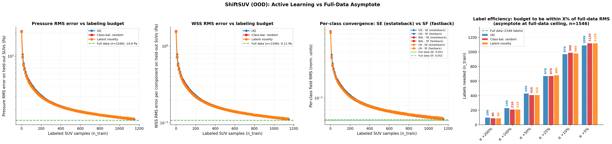
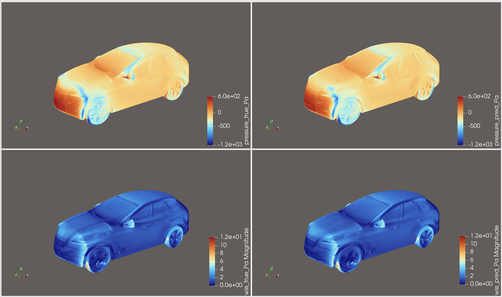
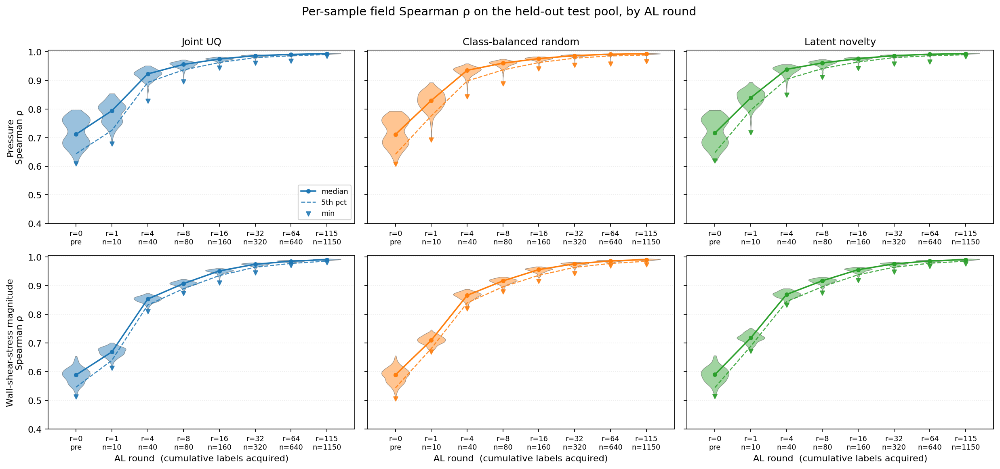

<!-- markdownlint-disable -->
# Active Learning for Surface-CFD Aerodynamic Surrogates

This recipe uses the **uncertainty-aware GeoTransolver + Variational GP
head** trained in [`../transformer_models/`](../transformer_models/README.md#variational-gp-head)
as a starting point and **iteratively fine-tunes it on a target vehicle
class via active learning (AL)**. This workflow aims to demonstrate the 
use of Active Learning as a method to efficiently fine-tune a surrogate model
on an out-of-distribution dataset.

The example is implemented for surface CFD on the
[ShiftSUV](https://huggingface.co/datasets/luminary-shift/SUV)
estateback / fastback dataset, but the AL recipe itself is
problem-agnostic: the CFD-specific pieces are isolated to two thin
modules (`aero_physics.py`, `aero_metrology.py`) so the same loop can
drive any uncertainty-quantified regression task. See
[Adapting to a new problem](#adapting-to-a-new-problem) below.

## Overview

Starting from a GP-augmented GeoTransolver checkpoint that has only ever
seen one body style (the in-distribution / "Fastback" pretrain), the AL
loop:

1. Scores every unlabeled candidate in a held-out target-class pool
   with a **joint UQ signal** — the disagreement between the
   GP-predicted drag and the field-integrated drag, plus the GP's
   posterior variance.
2. Selects the top-`k` most informative samples per round (those with
   the highest joint UQ signal — i.e. largest disagreement and/or
   highest GP posterior std).
3. Adds them to the training set and **fine-tunes** the backbone +
   pooling + GP head jointly (Field MSE + GP ELBO + consistency).
4. Evaluates on a frozen, per-class validation pool, logging
   `field_mse` and per-class breakdowns.
5. Repeats for `al_rounds` iterations, producing a
   `validation_metrics.json` trajectory + per-round checkpoints.

## Architecture

The full AL loop, end-to-end:

```
   ┌──────────────────────────────────────────────────────────────┐
   │  GP-pretrained checkpoint  (from transformer_models/)        │
   └─────────────────────────────┬────────────────────────────────┘
                                 │ load_checkpoint
                                 ▼
   ┌────────────────────────────────────────────────────────────────────┐
   │ Round r = 0                                                        │
   │  ┌──────────────────────┐                                          │
   │  │  Metrology on val    │ ──► field_mse, per-class fmse            │
   │  │ (FieldMetrology)     │                                          │
   │  └──────────────────────┘                                          │
   └────────────────────────────────────────────────────────────────────┘
                                 │
                                 ▼
   ┌────────────────────────────────────────────────────────────────────┐
   │ Round r = 1 … al_rounds                                            │
   │   ┌─────────────────────────────────────────────────┐              │
   │   │  QueryStrategy.score_pool                       │              │
   │   │    JointUQ  : disagreement + GP std            ─┼──► top-k     │
   │   │    Random / ClassBalancedRandom                 │     samples  │
   │   └─────────────────────────────────────────────────┘              │
   │                              │                                     │
   │                              ▼                                     │
   │   ┌─────────────────────────────────────────────────-┐             │
   │   │  Fine tune fine_tune_epochs (CombinedOptimizer): │             │
   │   │    L = field_MSE + λ_gp · GP_ELBO + λ_c · cons.  │             │
   │   └─────────────────────────────────────────────────-┘             │
   │                              │                                     │
   │                              ▼                                     │
   │   ┌──────────────────────┐                                         │
   │   │  Metrology on val    │ ──► validation_metrics.json (per round) │
   │   └──────────────────────┘                                         │
   └────────────────────────────────────────────────────────────────────┘
```

Internally the code is organized as **three architectural layers** that
make customization explicit:

| Layer | Files | What it does | Swap to adapt? |
|-------|-------|--------------|----------------|
| **1. Generic AL recipe** | `run_al.py`, `al_train_step.py`, `strategies.py`, `utils.py` | The driver loop, per-batch training step, query/label strategies, DDP helpers. Not CFD or aerodynamics specific. | No — this is the recipe you reuse. |
| **2. GP-UQ recipe** | `gp_utils.py` | Variational GP head wiring: spectral-norm embeddings, ramped weights, gradient sync for non-DDP modules. | Only if you change the UQ method (e.g. swap GP for an ensemble or MC-Dropout). |
| **3. Aero adapter** | `aero_physics.py`, `aero_metrology.py`, `data_pool.py` | Drag integral / freestream non-dimensionalization, field-MSE metrology, dataset I/O. | **Yes** — this is what you replace for a new problem. |

Layers 1 and 2 are written against the
`physicsnemo.active_learning` protocols (`QueryStrategy`,
`LabelStrategy`, `MetrologyStrategy`) and the
`physicsnemo.experimental.uq.VariationalGPHead`; layer 3 is CFD specific
— this is where domain quantities such as `pressure`, `wss`, `Cd`, and
`freestream` are referenced directly.

## Example layout

```
active_learning_aero/
├── README.md                  
├── requirements.txt
├── runs/                      ← per-experiment outputs (gitignored)
└── src/
    ├── conf/                  ← Hydra configs (al_config.yaml, …)
    ├── manifests/             ← per-class JSON splits (test/pool)
    ├── run_al.py              ← AL driver (entry point)
    ├── al_train_step.py       ← per-batch training step
    ├── strategies.py          ← Query/Label strategies
    ├── aero_metrology.py      ← FieldMetrologyStrategy
    ├── aero_physics.py        ← drag integral + non-dim constants
    ├── gp_utils.py            ← GP-UQ recipe helpers
    ├── data_pool.py           ← AeroDataPool + build_pool / build_surface_factors
    ├── utils.py               ← CombinedOptimizer, padded_all_gather, …
    ├── infer_aero.py          ← VTP point-cloud predictions
    └── create_manifests.py    ← test/pool split builder
```

Run scripts from the example root (`active_learning_aero/`), so Hydra
resolves `src/conf/` and `src/manifests/` correctly:

```bash
cd examples/cfd/external_aerodynamics/active_learning_aero
torchrun --nproc_per_node=8 src/run_al.py ...
```

## Requirements

This example shares the same dependency closure as the
[GP + GeoTransolver pretraining recipe](../transformer_models/README.md#variational-gp-head),
plus three AL-specific extras: `gpytorch` (variational GP head),
`pyvista` (VTP writing in `infer_aero.py`), and `matplotlib` (the
convergence summary plotter). Install with:

```bash
pip install -r requirements.txt
```

You also need PhysicsNeMo 26.03 or higher.

## Pretraining prerequisite

This example consumes a checkpoint from the GP + GeoTransolver pretraining
recipe — it does **not** train a model from scratch. Before running AL,
follow the steps under
[**Variational GP Head → Training**](../transformer_models/README.md#training)
in the transformer-models README to produce a `checkpoints_combined/`
directory containing the pretrained GeoTransolver, AttentionPooling, and
VariationalGPHead state dictionaries. That path becomes the
`++initial_checkpoint=…` argument below.

## Building the data manifests

Active learning needs a **frozen test set** so that every AL trajectory
is evaluated against the same held-out samples. `create_manifests.py`
walks each class's Zarr directory once and writes a JSON manifest
specifying the test indices (typically the first 100 per class) and
pool indices (the rest) for that class. All AL runs then read the same
manifests, ensuring fair comparison across acquisition strategies and
seeds.

Start by building the manifests:

```bash
python src/create_manifests.py \
    --zarr-paths \
        SE=/path/to/shift_suv_estateback_zarr/val \
        SF=/path/to/shift_suv_fastback_zarr/val \
    --test-samples-per-class 100 \
    --output-dir src/manifests
```

This writes `src/manifests/manifest_class_SE.json` and
`src/manifests/manifest_class_SF.json`, each containing
`{class, zarr_path, test_indices, pool_indices}`. The same files are
read by `run_al.py`, `train_ceiling.py`, and any inference / metrology
script that needs the held-out test pool.

## Quick start

Once the pretraining checkpoint and manifests are in place, launch a
joint-UQ AL experiment on 8 GPUs using:

```bash
torchrun --nproc_per_node=8 src/run_al.py \
    --config-name=al_config \
    ++initial_checkpoint=/path/to/checkpoints_combined \
    ++manifest_dir=src/manifests \
    ++acquisition=joint_uq \
    ++samples_per_round=10 \
    ++al_rounds=80 \
    ++fine_tune_epochs=20 \
    ++data.physics_nondim.enabled=true \
    ++data.physics_nondim.U_inf=30.0 \
    ++data.physics_nondim.rho_inf=1.225 \
    ++data.physics_nondim.p_inf=0.0 \
    ++data.physics_nondim.wss_factor=0.00183 \
    ++data.reference_scale=[5.0,5.0,5.0] \
    ++run_id=geotransolver/surface/al_shiftsuv_uq
```

A round-1 smoke test (single GPU, two samples, one fine-tune epoch)
typically completes in a few minutes:

```bash
torchrun --nproc_per_node=1 src/run_al.py \
    --config-name=al_config \
    ++initial_checkpoint=/path/to/checkpoints_combined \
    ++manifest_dir=src/manifests \
    ++samples_per_round=2 \
    ++al_rounds=1 \
    ++fine_tune_epochs=1 \
    ++run_id=_smoke
```

Outputs land under `runs/<run_id>/<acquisition>/`:

```
runs/geotransolver/surface/al_shiftsuv_uq/joint_uq/
├── checkpoint_round_{1,2,…}/   ← per-round model state
├── selection_history.json       ← which sample indices were acquired each round
└── validation_metrics.json      ← per-round field_mse + per-class breakdown
```

## Acquisition strategies

Four strategies ship with this example, all implementing the
`physicsnemo.active_learning.QueryStrategy` protocol. Select via
`++acquisition=…`:

| Strategy | `++acquisition=` | When to use |
|----------|------------------|-------------|
| **JointUQQueryStrategy** | `joint_uq` | The recommended UQ-driven default. Per-sample score is `max(|disagreement|, 2 · GP_std)`, where *disagreement* is `|Cd_GP − Cd_field|` — i.e. the gap between the GP-head Cd prediction and the field-integrated Cd recovered from the same forward pass. |
| **RandomQueryStrategy** | `random` | Pure random baseline (uniform over the pool). Use as a UQ-vs-random sanity check. |
| **ClassBalancedRandomQueryStrategy** | `class_balanced_random` | Random *within each class*, with the per-round budget split proportionally. Use as a strong baseline that controls for class imbalance in the pool. |
| **LatentNoveltyQueryStrategy** | `latent_novelty` | Encoder-only novelty signal: each round we calibrate the embedded `OODGuard` (from `physicsnemo.experimental.guardrails.embedded`) on the currently labeled set, then rank unlabeled samples by their average kNN cosine distance in the learned geometry-latent space. Reuses the same guardrail that flags OOD inputs at inference time as the acquisition signal. The first round falls back to class-balanced random because the calibration buffer is empty. |

Adding a new strategy is a matter of subclassing `QueryStrategy` from
`physicsnemo.active_learning.protocols`, implementing
`select(pool, budget, …) → list[int]`, and registering it in the
`if/elif` block near the top of `run_al.py`. The driver is
acquisition-agnostic.

There is also a single `DummyLabelStrategy` (`LabelStrategy` protocol)
that no-ops because labels are pre-computed on disk; replace it if your
AL setup involves an oracle that synthesizes labels on demand.

## Results

The plot below summarizes a experiment on the ShiftSUV
out-of-distribution dataset (1727 total samples; 181 held out for test,
leaving 1546 in the trainable pool). All three acquisition strategies —
joint UQ, class-balanced random, and latent novelty — close the gap
between the pretrained DrivAerStar Fastback-only model and a ShiftSUV
full-data ceiling that sees every trainable sample (n = 1546). Pressure
and wall-shear-stress (WSS) RMS errors are reported in physical units
after un-standardization.



### Qualitative field comparison

Below is a representative held-out SUV from the test pool with the trained AL
model's predicted surface fields next to the ground truth. Top row is
pressure (Pa); bottom row is wall-shear-stress magnitude (Pa). Left =
ground truth from the simulator; right = model prediction.



VTP point clouds for any test sample at any saved AL checkpoint can be
regenerated with `infer_aero.py`.

### Per-sample spatial fidelity

Aggregate RMS hides whether each individual surface field is
*shape-correct*. To check that, we take the held-out test pool (181
samples) at every saved AL checkpoint and compute, *per sample*, the
Spearman rank correlation between predicted and ground-truth pressure
and wall-shear-stress magnitude. The violins below show how the
**distribution of per-sample correlations** tightens across rounds:
the median moves toward 1.0, the 5th-percentile dashed line catches
up (worst-case samples improve faster than the best-case ones), and
the lower tail of the violin shrinks. All three strategies — UQ,
class-balanced random, and latent novelty — reach median ρ > 0.97 by
round 16 (n=160 labels) — well before the labels-needed thresholds in
the table below — meaning the spatial patterns are already correct
long before the absolute RMS hits its asymptote.



### Label efficiency

Numbers from the rightmost panel of the summary plot —
**labels needed to land within X% of the full-data RMS asymptote**
(n_pool = 1546):

| Within X% of ceiling | Joint-UQ labels | Class-bal random labels | Latent-novelty labels | Fraction of pool |
|----------------------|-----------------|-------------------------|-----------------------|------------------|
| 100% | 230 | 210 | 210 | ~14% |
| 50% | 430 | 410 | 410 | ~27% |
| 25% | 670 | 670 | 680 | ~43% |
| 10% | 970 | 990 | 980 | ~63% |
| 5% | 1090 | 1120 | 1120 | ~72% |

At the final round of each chain (UQ at n=1150; BAL and LN at n=1140),
pressure RMS is **15.00 Pa (UQ) / 15.30 Pa (BAL) / 15.22 Pa (LN)**
against a full-data ceiling of **14.57 Pa**, i.e. +3.0% / +5.0% / +4.5%
above the asymptote. Read the +5% row as: *"to drive the surface-field
RMS to within 5% of what training on every available sample would give
us, we need to hand-label roughly two-thirds of the pool"* — and the
+25% row as the more frugal *"with ~40% of the labels we already cut
the gap-to-ceiling to a quarter of what it was."* Joint-UQ wins by a
small but consistent margin at every threshold; latent novelty matches
class-balanced random closely without using class labels at
acquisition time, making it a viable drop-in for problems where class
metadata is unavailable.

## Adapting to a new problem

The AL loop in this example is not specific to surface CFD. To retarget
it to a different uncertainty-quantified regression task:

1. **Replace `aero_physics.py`.** This module owns the constants and
   per-batch operators that turn raw model outputs into the scalar
   quantity of interest for AL scoring (here: drag coefficient via
   surface integration). Define your own QoI integral / non-dim
   scaling — anything that maps `(B, N, output_dim)` to `(B,)`.
2. **Replace `aero_metrology.py`.** This module owns the
   `MetrologyStrategy` that runs over a frozen validation pool each
   round and writes the headline metric to `validation_metrics.json`.
   For a different QoI, swap the per-class `field_mse` for whatever
   accuracy / calibration metric matters for your domain.
3. **Regenerate manifests** with `create_manifests.py` (or write your
   own splitter) so each "class" in your problem has a frozen test set
   and an AL pool. The split is what guarantees apples-to-apples
   trajectory comparison.

## References

- **GeoTransolver:** [GeoTransolver](https://arxiv.org/abs/2512.20399), built on the [Transolver](https://arxiv.org/abs/2402.02366) backbone with GALE attention.
- **Variational GP head:** [Scalable Variational Gaussian Process Classification](https://arxiv.org/abs/1411.2005) — Hensman et al., 2015.
- **SNGP / DUE:** [Simple and Principled Uncertainty Estimation with Deterministic Deep Learning](https://arxiv.org/abs/2006.10108) — van Amersfoort et al., 2020.
- **Active learning with GPs / disagreement:** [BatchBALD](https://arxiv.org/abs/1906.08158) — Kirsch et al., 2019; [Query-by-committee](https://dl.acm.org/doi/10.1145/130385.130417) — Seung et al., 1992.
- **DrivAerStar dataset:** [DrivAerStar: A Body-Fitted Overset Mesh Dataset for Automotive External Aerodynamics](https://arxiv.org/abs/2510.16857) — Qiu et al., 2025.
