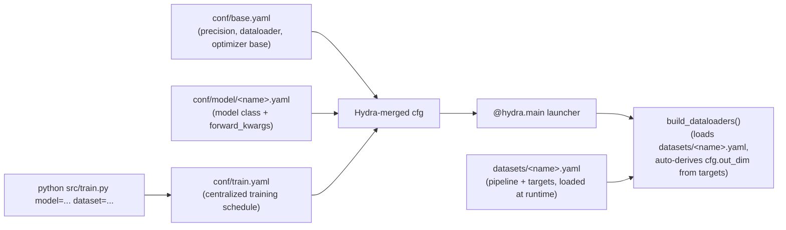

<!-- markdownlint-disable -->
# Unified External Aerodynamics Recipe

## Introduction

External aerodynamics recipes in PhysicsNeMo have proliferated: we have
a number of recipes, across a range of models, all working on different models
with unique data handling, pipelines, model architectures, metrics, training
paradigms, etc.  While there is nothing wrong with that, it does make comparison
challenging and development of new models somewhat challenging.  In this folder,
we have unified the external aerodynamic recipes for our best models, including
GLOBE (our newest model, designed for large 3D use cases).

Here, you're able to train (and run inference with) the following models:
- [DoMINO](https://arxiv.org/abs/2501.13350) coming soon
- [Transolver](https://arxiv.org/abs/2402.02366)
- [GeoTransolver](https://arxiv.org/abs/2512.20399), optionally using the [FLARE](https://arxiv.org/abs/2508.12594) attention mechanism backend
- [GLOBE](https://arxiv.org/abs/2511.15856)

We currently support the following datasets:
- DrivaerML

Support for these datasets is coming imminently, with pre-processing support from
PhysicsNeMo-Curator:
- ShiftSUV Estate
- ShiftSUV Fastback
- ShiftWING
- HiftliftAeroML

## Dataset Handling

The pipeline non-dimensionalizes raw fields to unitless model inputs
(see the YAML configs in `datasets/`). Per-sample reference freestream
conditions (`U_inf`, `rho_inf`, `p_inf`, ...) live in each file's
`global_data` and are read by `MeshReaderWithGlobalData`. Because the
datasets are non-dimensionalized and loaded through the PhysicsNeMo
datapipes' `MultiDataset` abstraction, you can merge datasets on the fly
for multi-dataset training; the infrastructure supports it, though we
haven't extensively tuned it. Non-dimensionalization itself is the
`NonDimensionalizeByMetadata` transform in `src/nondim.py`.

## Quick start

```bash
cd examples/cfd/external_aerodynamics/unified_external_aero_recipe

# 1. Train (single GPU, default model + dataset = GeoTransolver / DrivAerML volume)
python src/train.py

# 1b. Pick a different model and/or dataset on the CLI
python src/train.py model=transolver_surface dataset=drivaer_ml_surface

# 1c. Train (multi-GPU)
torchrun --nproc_per_node=N src/train.py

# 2. Override any config value
python src/train.py precision=bfloat16 training.num_epochs=100

# 3. Run inference on a trained checkpoint
#    (writes physical-unit .pdmsh predictions + CD/CL/CM for surface cases)
python src/infer.py model=geotransolver_surface dataset=highlift_surface \
    run_id=<the trained run_id> infer_split=test
```

For the canonical CLI invocations of every named recipe (FA variants,
GLOBE, multi-dataset Transolver, HiLift, DoMINO), see the
[Recipe Gallery](#recipe-gallery) section below.

## Pipeline architecture

Each dataset gets its own `MeshDataset` / `DomainMeshDataset` with an
ordered chain of `MeshTransform` steps defined in YAML; multiple
datasets are merged via `MultiDataset`. The pipeline is
**DomainMesh-native end-to-end**: every dataset YAML produces a
`DomainMesh` (see the
[DomainMesh contract](#domainmesh-contract-and-the-data-to-model-mapping)),
and each model YAML's `forward_kwargs:` block declaratively maps
DomainMesh paths into the model's `forward()` kwargs. The recipe collate
either passes those values through (mesh-native models like GLOBE) or
batch-wraps them into `(B, N, C)` tensors (transformer-style models).

```mermaid
flowchart LR
    pdmsh[".pdmsh on disk"] --> Reader["MeshReader / DomainMeshReader"]
    Reader --> Pipeline["mesh transforms (DropMeshFields, CenterMesh, NonDim, Rename, Normalize, ComputeSurfaceNormals, SubsampleMesh, ...)"]
    Pipeline --> Term["MeshToDomainMesh (surface only; volume already produces DomainMesh natively)"]
    Term --> Multi["MultiDataset (optional; concatenates samples across datasets)"]
    Multi --> Collate["build_collate_fn(input_type, forward_kwargs_spec, target_config)"]
    Collate --> Branch{"input_type?"}
    Branch -- mesh --> mk["forward_kwargs as Mesh / dict / scalar tensors (no batch dim)"]
    Branch -- tensors --> tk["forward_kwargs as batched tensors (1, N, C)"]
    mk --> Model["model.forward(**kwargs)"]
    tk --> Model
    Model --> Out{"output_type?"}
    Out -- mesh --> mout["Mesh.point_data"]
    Out -- tensors --> tout["(1, N, C) tensor"]
    mout --> Norm["normalize to TensorDict[name -> Tensor]"]
    tout --> Norm
    Norm --> Loss["LossCalculator + MetricCalculator (TensorDict interface; optional field_weights)"]
```



### Why each step exists

- **Freestream conditions on `global_data`** — Each sample's freestream
  conditions (`U_inf`, `rho_inf`, `p_inf`, `nu`, `L_ref`, and `T_inf`
  for compressible datasets) are embedded at the **domain level** of each
  `.pdmsh` / `.pmsh` at conversion time, so transforms like
  `NonDimensionalizeByMetadata` read them straight off the loaded sample.
  Surface configs read a boundary `Mesh` whose own `global_data` is
  typically empty, so they use the recipe-local
  `MeshReaderWithGlobalData` to merge the domain-level `global_data` onto
  each boundary at load time. See [Design decisions](#design-decisions)
  for the rationale.

- **DropMeshFields** — Removes fields that are not needed for training
  (e.g. `TimeValue` in DrivaerML) to reduce memory and avoid schema
  mismatches when merging datasets.

- **CenterMesh** — Centers each geometry at the origin so that
  rotations happen around a sensible point.  DrivaerML uses point-mean
  centering (`use_area_weighting: false`); SHIFT SUV uses area-weighted
  cell centroid centering (`use_area_weighting: true`).

- **RandomRotateMesh / RandomTranslateMesh** — Data augmentation,
  defined in the `augmentations:` block of each dataset config and
  activated at runtime by setting `augment: true` (default `false`).
  Augmentations are inserted after `CenterMesh` by the dataset builder.
  Rotation is restricted to the vertical axis.  Translation is restricted
  to horizontal axes by setting the vertical component of the offset
  distribution to zero.

- **NonDimensionalizeByMetadata** — Converts raw physical fields into
  non-dimensional coefficients using the per-sample freestream
  conditions stored on `metadata`:
    - Pressure → Cp: `(p - p_inf) / q_inf` where `q_inf = 0.5 * rho_inf * |U_inf|²`
    - Wall shear stress → Cf: `tau / q_inf`
    - Velocity → `U / |U_inf|`

  Also supports temperature, density, and identity (pass-through) field
  types, and provides an `inverse()` for re-dimensionalizing predictions.
  Input points are non-dimensionalized by a single reference scalar
  `L_ref` (rather than scaling x/y/z independently) so geometry aspect
  ratios are preserved.

- **ComputeSDFFromBoundary** — Volume pipelines only.  Computes a
  signed distance field (and surface normals) from an auxiliary STL
  boundary mesh loaded via the reader's `extra_boundaries` option.
  The SDF and normals are stored into `point_data` and used as
  geometry-aware input features for the model.

- **DropBoundary** — Removes the auxiliary STL boundary mesh after
  `ComputeSDFFromBoundary` has consumed it, keeping only the interior
  volume and the original surface boundary.

- **RenameMeshFields** — Maps dataset-specific field names to canonical
  names (`pressure`, `wss`, `velocity`, etc.) so all downstream code
  uses a single naming convention.

- **NormalizeMeshFields** — Applies z-score normalization using
  inline statistics declared in the YAML config or loaded from a `.pt`
  file.  Handles scalar and vector fields differently.  The normalization
  stats are saved alongside model checkpoints for use at inference time.

  Note that not all fields are normalized, in fact most are not.  Only fields
  that are particularly far from unit mean or standard deviation are normalized.

- **ComputeSurfaceNormals** — Computes per-cell (or per-point) surface
  normals from the mesh connectivity.  Used in surface pipelines to
  provide normal vectors as part of the model's local embedding.

- **SubsampleMesh** — Randomly downsamples each mesh to a fixed size
  (controlled by `sampling_resolution` in the training config) so that
  samples can be batched.  Different samples in the same dataset get
  different random subsets each epoch.

- **MeshToDomainMesh** — Terminal transform for surface dataset YAMLs
  (volume YAMLs already produce a `DomainMesh` natively via
  `DomainMeshReader`). Converts the surface `Mesh` into a
  `DomainMesh(interior, boundaries={"vehicle": ...}, global_data)` per
  the prediction-vs-input contract described under
  [DomainMesh contract](#domainmesh-contract-and-the-data-to-model-mapping).
  The dataset builder auto-injects `cell_data_targets` from the YAML's
  `targets:` block, so users don't list field names twice.

## Model and training

The default model is **GeoTransolver**, a transformer-based architecture
for point-cloud regression that uses multi-scale local attention with
geometric embeddings.

### Default settings (GeoTransolver automotive surface)

| Setting | Default |
|---|---|
| Model | `GeoTransolver` (12 layers, 256 hidden, 8 heads) |
| Attention type | `GALE` (also supports `GALE_FA` for FLARE-based self-attention) |
| State mixing | `weighted` (learnable sigmoid gate; also supports `concat_project`) |
| Input | Cell centroids (N×3) + surface normals (N×3) + freestream velocity (1×3) |
| Output | Pressure (1) + wall shear stress (3) = 4 channels |
| Loss | Huber (smooth L1), normalized by total channels |
| Optimizer | Muon (2D params) + AdamW (other params) |
| Scheduler | StepLR (step=100, gamma=0.1) |
| Precision | bfloat16 (float16/float32 also supported) |
| Batch size | 1 |

### DomainMesh contract and the data-to-model mapping

Each dataset YAML's pipeline produces a [`DomainMesh`](../../../physicsnemo/mesh/domain_mesh.py)
that follows a simple semantic contract:

- **`interior`** — answers "where should the output be?". For surface
  configs this is a `Mesh[0, 3]` point cloud at the cell centroids of
  the (subsampled) car body surface; for volume configs it's the volume
  mesh's interior points. Prediction targets live in
  `interior.point_data` and are extracted by the loss / metric
  calculators by name.
- **`boundaries`** — answers "what are the inputs?". A `dict[str, Mesh]`
  keyed by boundary name. The car / aircraft body is keyed `"vehicle"`
  in both surface and volume configs (the curated DrivAerML and
  HighLiftAeroML `.pdmsh` files standardize on `vehicle` as the
  canonical body-boundary key, so `boundaries.vehicle` resolves
  uniformly across domains). Surface configs additionally carry
  precomputed cell normals on `boundaries.vehicle.cell_data` (from
  `ComputeSurfaceNormals` in the surface dataset pipelines).
- **`global_data`** — per-sample freestream conditions (`U_inf`,
  `L_ref`, etc.) embedded directly in the data files.

**Each model YAML declares its data contract** with three top-level fields:

- `input_type: mesh | tensors`. Controls whether the collate passes
  forward kwargs through as Mesh / DomainMesh / dict objects (for
  mesh-native models like GLOBE) or extracts and batch-stacks tensors
  (for transformer models like GeoTransolver).
- `output_type: mesh | tensors`. Controls how the model output is
  unpacked for the loss: `Mesh.point_data` lookup vs. tensor channel
  splitting by `target_config` order.
- `forward_kwargs:`. A declarative spec mapping `model.forward()` kwarg
  names to paths into the DomainMesh.

The `forward_kwargs:` spec syntax is intentionally minimal:

| Spec value | Resolves to |
|---|---|
| `"interior.points"` | The tensor at that dotted path on the DomainMesh (walked via getattr-then-getitem). Empty string `""` resolves to the source itself. |
| `1.0` (number) | A 0-d float32 tensor literal. |
| `[a, b, c]` | Each element resolved, then `torch.cat` along the last dim. Used for tensor-input models that want concatenated feature vectors (e.g. `[interior.points, boundaries.vehicle.cell_data.normals]`). |
| `{a: ..., b: ...}` | Each value resolved, returned as a dict. Used for dict-valued kwargs (e.g. GLOBE's `boundary_meshes: {vehicle: boundaries.vehicle}` and `reference_lengths: {L_ref: 1.0, delta_turb: 0.015}`). |
| `{source: <path>, expand_like: <other_kwarg>}` | Resolve `source` then expand its axis -2 to match `<other_kwarg>`'s axis -2. Used by Transolver / FLARE-style models that need a per-sample feature (e.g. freestream velocity) broadcast across the per-element axis of another kwarg. |

For tensor-input models, scalars and 1-D vectors in `forward_kwargs`
are padded up to ndim>=2 before the batch dim is added (so `U_inf`
shape `(3,)` becomes `(1, 1, 3)` and lines up with per-element features
shaped `(1, N, C)`). For mesh-input models, no batch dim is added at
all.

**Targets always live at `interior.point_data.<name>` by contract.**
The dataset YAML's `targets:` block declares the names + types; the
recipe's dataset builder also auto-injects those names into the
`MeshToDomainMesh` transform so you don't have to list them twice.

Example (GeoTransolver surface):

```yaml
input_type: tensors
output_type: tensors
forward_kwargs:
  geometry: interior.points
  local_embedding:
    - interior.points
    - boundaries.vehicle.cell_data.normals
  local_positions: interior.points
  global_embedding: global_data.U_inf
```

Example (GLOBE surface):

```yaml
input_type: mesh
output_type: mesh
forward_kwargs:
  prediction_points: interior.points
  boundary_meshes:
    vehicle: boundaries.vehicle
  reference_lengths:
    L_ref: 1.0
    delta_turb: 0.015
```

Available models and datasets:

| Group | Files |
|---|---|
| `model/` (`conf/model/*.yaml`) | `geotransolver_{surface,volume,volume_highlift}`, `transolver_{surface,volume}`, `flare_{surface,volume}`, `globe_{surface,volume}`, `domino_{surface,volume}` |
| `dataset/` (`datasets/*.yaml`) | `drivaer_ml_{surface,volume}`, `highlift_{surface,volume}`, `shift_suv_{estate,fastback}_surface` |

Pick one of each on the CLI:

```bash
python src/train.py model=<one of above> dataset=<one of above>
```

To add a new model, drop a new template under `conf/model/` declaring
`input_type`, `output_type`, `forward_kwargs`, and the `model:` block.
No registry edits needed.

The **loss calculator** (`src/loss.py`) and **metric calculator**
(`src/metrics.py`) operate on `TensorDict` predictions and targets,
keyed by the field names declared in the dataset YAML's `targets:` block.
The collate produces the targets `TensorDict` (`batch_size=[N]` in
mesh-input mode, `[1, N]` in tensor-input mode); the predictions
`TensorDict` is built from the model output with matching `batch_size`.
For each field, the loss type is applied per the field's type (`scalar`
or `vector`); per-field losses are then weighted by the optional
`training.field_weights` block in the model YAML and summed.

Supported loss types: Huber (default), MSE, relative MSE.
Supported metrics: relative L1, relative L2, MAE.

**`training.field_weights`** is a model-side dict that multiplies each
per-field loss before summation. Use it to balance fields with very
different natural scales (e.g. GLOBE's
`{pressure: 1.0, wss: 100.0}` mimics the standalone recipe's
`error_scales = {C_p: 1.0, C_f: 0.01}` weighting).

**`batch_size > 1`** is not supported by any model in the recipe today;
the YAML field is reserved for future use, and the recipe raises
`NotImplementedError` (in `build_dataloaders` and the collate) if you try
to set it above 1.

## Scripts

All scripts are run from the recipe root directory:

```bash
cd examples/cfd/external_aerodynamics/unified_external_aero_recipe
```

### Train

See [Quick start](#quick-start) for the common invocations and the
[Recipe Gallery](#recipe-gallery) for every named recipe. Training
supports checkpointing (auto-resume), TensorBoard + JSONL logging,
mixed precision (float16/bfloat16), `torch.compile`, and NVIDIA
profiling.

### Infer

```bash
# Run a trained checkpoint over a split, writing physical-unit predictions
python src/infer.py model=geotransolver_surface dataset=highlift_surface \
    run_id=<the trained run_id> infer_split=test

# Point at an explicit checkpoints directory instead of deriving from run_id
python src/infer.py model=geotransolver_surface dataset=highlift_surface \
    run_id=eval checkpoint_path=/path/to/run/checkpoints
```

`infer.py` is the inference companion to `train.py`: it shares
`conf/base.yaml` (so precision / dataloader knobs match) and reuses the
same dataloader, output-normalization, and metric machinery. It loads
the checkpoint named by `run_id` (under `checkpoint_dir`, default
`runs/`), runs the model over `infer_split` (a manifest split; default
`test`), and writes one prediction per sample:

```text
${output_dir}/${run_id}/
  predictions/<sample_id>.pdmsh   # DomainMesh: interior carries
                                  # pred_<field> and true_<field>
  metrics.jsonl                   # infer_step + infer_summary records
```

- **Metrics** are reported in training space (non-dim / normalized), so
  they line up with the validation numbers logged during training. The
  JSONL carries one `infer_step` row per sample plus an `infer_summary`
  aggregate (and `infer_forces_summary` for surface cases).
- **Physical units**: written fields are re-dimensionalized
  (`redimensionalize=true`, default) by inverting normalization then
  non-dimensionalization; `rescale_geometry=true` additionally restores
  physical-scale coordinates (the lost `CenterMesh` offset leaves them
  centered at the origin).
- **Force / moment coefficients** (surface cases): integrates the
  predicted and reference surface traction (`-Cp*n + Cf`) over the
  `vehicle` boundary into `CD`/`CL`/`CS` (drag/lift/side) and
  `CMR`/`CMP`/`CMY` (roll/pitch/yaw), logged as a per-coefficient
  pred / true / MAE table. Set `force_coefficients.reference_area` (and
  optionally `reference_length` / `moment_center`) for physically
  meaningful magnitudes; the predicted-vs-reference comparison is
  independent of the reference area. Volume runs (no Cp/Cf) auto-skip.
  See `src/forces.py` for the integration and sign conventions.
- Inference runs at full mesh resolution by default (a large
  `sampling_resolution` makes the reader's subsample a no-op).

### Benchmark datapipe throughput

```bash
python src/train.py benchmark_io=true
python src/train.py benchmark_io=true +training.benchmark_max_steps=20
```

> NOTE: If you want to profile, we recommend you set the number of epochs to 2.

Measures per-sample load time and throughput without running the model.

## Configuration

A single canonical `conf/train.yaml` drives every training run. It picks
one entry from `conf/model/` and one dataset from `datasets/` via
Hydra-style `model=...` and `dataset=...` overrides, applies the
centralized training schedule, and runs the loop. Every named recipe is
reproducible from CLI overrides.

```text
unified_external_aero_recipe/
  conf/
    base.yaml                  # universal cross-cutting defaults
                               # (precision, dataloader, logging,
                               #  optimizer base, training fundamentals)
    train.yaml                 # the training entry point
    infer.yaml                 # the inference entry point (companion)
    model/                     # model templates (Hydra group)
      geotransolver_{surface,volume,volume_highlift}.yaml
      transolver_{surface,volume}.yaml
      flare_{surface,volume}.yaml
      globe_{surface,volume}.yaml
      domino_{surface,volume}.yaml
  datasets/                    # one file per dataset (loaded at runtime
                               #  by load_dataset_config, NOT by Hydra)
    dataset_paths.yaml         # local disk paths (edit me)
    drivaer_ml_{surface,volume}.yaml
    highlift_{surface,volume}.yaml
    shift_suv_{estate,fastback}_surface.yaml
  src/
  tests/
```

### Architectural split

| Concern | Lives in |
|---|---|
| Pipeline + dataset construction | `datasets/<dataset>_<modality>.yaml` (one file per dataset) |
| Disk paths | `datasets/dataset_paths.yaml` (only thing the user has to edit per machine) |
| Splits (definitions) | `manifest.json` next to each dataset on disk |
| Splits (which one to use) | `train.yaml` (`train_split`, `val_split`) |
| Sampling resolution | `train.yaml` (`sampling_resolution`) |
| Metrics list | `train.yaml` (`metrics`) |
| Multi-dataset orchestration | `train.yaml` (`extra_datasets`) + Python in `datasets.build_dataloaders` |
| Model + forward_kwargs | `conf/model/<name>.yaml` |
| Training schedule (lr, scheduler, num_epochs, compile) | `train.yaml` |

### `conf/train.yaml`

```yaml
defaults:
  - base
  - model: geotransolver_volume
  - _self_

# Dataset selection (a string naming a file in datasets/, no `.yaml`)
dataset: drivaer_ml_volume

# Multi-dataset: list of additional datasets to combine via MultiDataset
extra_datasets: []

# Manifest-mode split selectors (no-op for directory-mode datasets)
train_split: train
val_split: val

# Recipe-side dataset overrides
sampling_resolution: 200000
metrics: [l2]

run_id: "${hydra:runtime.choices.model}__${dataset}__${now:%Y%m%d_%H%M%S}"
output_dir: "runs"
checkpoint_dir: null
compile: true

training:
  num_epochs: 500
  optimizer:
    lr: 3.0e-3
  scheduler:
    _target_: torch.optim.lr_scheduler.StepLR
    step_size: 100
    gamma: 0.1
```

### How the pieces compose



Notes on the composition:

- Every file under `conf/model/` starts with `# @package _global_`, so
  its contents merge at the global root rather than under the group
  name. This lets one model file declare `model:` AND
  `input_type` / `output_type` / `forward_kwargs:` together.
- `_self_` is the LAST entry in `train.yaml`'s `defaults:` so any inline
  `model:` / `training:` / `dataloader:` overrides win over the model
  template values.
- Forward kwargs live alongside the model in the same template because
  they are a property of the model class's forward signature, not an
  independent dimension.
- The model template's `out_dim: ${out_dim}` interpolation resolves
  against a top-level `out_dim` value that `build_dataloaders()`
  computes from the chosen dataset's `targets:` block (sum of channel
  counts via `field_dim()`). GLOBE templates declare per-target
  `output_field_ranks` instead and don't touch `out_dim`.
- `conf/infer.yaml` follows the same shape:
  `defaults: - base, - model: ???, - _self_` with checkpoint /
  output-path knobs in place of the training schedule. `base.yaml` is
  intentionally training-agnostic so both entry points can share it.

### Recipe Gallery

Canonical CLI invocations for every named recipe the recipe ships with:

```bash
# Default (GeoTransolver + DrivAerML volume)
python src/train.py

# GeoTransolver, DrivAerML surface (the original recipe disabled torch.compile)
python src/train.py model=geotransolver_surface dataset=drivaer_ml_surface \
    compile=false

# GeoTransolver + GALE_FA attention, DrivAerML surface
python src/train.py model=geotransolver_surface dataset=drivaer_ml_surface \
    +model.attention_type=GALE_FA

# GeoTransolver + GALE_FA attention, DrivAerML volume (heavy variant)
python src/train.py model=geotransolver_volume dataset=drivaer_ml_volume \
    +model.attention_type=GALE_FA model.n_layers=20 \
    model.state_mixing_mode=concat_project \
    sampling_resolution=100000 'metrics=[l2,l1]' \
    training.scheduler.step_size=50 training.scheduler.gamma=0.05 \
    dataloader.pin_memory=false

# GeoTransolver + GALE_FA, HiLift surface
python src/train.py model=geotransolver_surface dataset=highlift_surface \
    +model.attention_type=GALE_FA training.num_epochs=200 \
    sampling_resolution=100000

# Transolver
python src/train.py model=transolver_surface dataset=drivaer_ml_surface \
    training.optimizer.lr=1e-3 training.scheduler.gamma=0.5
python src/train.py model=transolver_volume dataset=drivaer_ml_volume \
    training.optimizer.lr=1e-3 training.scheduler.gamma=0.5

# Transolver across DrivAerML + SHIFT SUV (multi-dataset)
python src/train.py model=transolver_surface dataset=drivaer_ml_surface \
    'extra_datasets=[shift_suv_estate_surface, shift_suv_fastback_surface]' \
    training.optimizer.lr=1e-3 training.scheduler.gamma=0.5

# FLARE
python src/train.py model=flare_surface dataset=drivaer_ml_surface \
    training.optimizer.lr=1e-3 training.scheduler.gamma=0.5
python src/train.py model=flare_volume dataset=drivaer_ml_volume \
    training.optimizer.lr=1e-3 training.scheduler.gamma=0.5

# GLOBE (mesh-native; needs different training knobs)
python src/train.py model=globe_surface dataset=drivaer_ml_surface \
    compile=false training.optimizer.lr=1e-2 training.num_epochs=10000 \
    'training.field_weights={pressure: 1.0, wss: 100.0}' \
    sampling_resolution=50000
python src/train.py model=globe_volume dataset=drivaer_ml_volume \
    compile=false training.optimizer.lr=1e-2 training.num_epochs=10000 \
    sampling_resolution=50000

# HiLift surface (vanilla GeoTransolver)
python src/train.py model=geotransolver_surface dataset=highlift_surface \
    training.num_epochs=200 sampling_resolution=100000 \
    dataloader.prefetch_factor=4 dataloader.num_workers=4

# HiLift volume
python src/train.py model=geotransolver_volume_highlift dataset=highlift_volume \
    compile=false training.num_epochs=200 sampling_resolution=100000

# DoMINO (DRAFT, doesn't run end-to-end)
python src/train.py model=domino_surface dataset=drivaer_ml_surface \
    compile=false training.optimizer.lr=1e-3 training.scheduler.gamma=0.5
python src/train.py model=domino_volume dataset=drivaer_ml_volume \
    compile=false training.optimizer.lr=1e-3 training.scheduler.gamma=0.5
```

Note the `+` prefix on `+model.attention_type=...` — Hydra requires `+`
when the override key isn't already present in the model template (FA
attention is opt-in, not the default).

### Dataset config anatomy

Surface dataset YAML (DrivAerML; produces a DomainMesh whose interior is
the prediction surface and whose `vehicle` boundary is the input
geometry):

```yaml
train_datadir: ${dataset_paths.drivaer_ml}

# Freestream conditions (U_inf, p_inf, rho_inf, nu, L_ref) are embedded
# at the domain level of each .pdmsh at data-conversion time. The
# surface reader points at the boundary tensordict inside that .pdmsh,
# so we use MeshReaderWithGlobalData to merge the parent DomainMesh's
# global_data onto each boundary Mesh at load time.

# Transform pipeline — each entry is Hydra-instantiated
pipeline:
  reader:
    _target_: ${dp:MeshReaderWithGlobalData}
    path: ${train_datadir}
    pattern: "run_*/*.pdmsh/_tensordict/boundaries/vehicle"
    subsample_n_cells: ${sampling_resolution}
    merge_global_data_from: "../../global_data"
  augmentations:
    - _target_: ${dp:RandomRotateMesh}
      axes: ["z"]
      transform_cell_data: true
      transform_global_data: true
    - _target_: ${dp:RandomTranslateMesh}
      distribution:
        _target_: torch.distributions.Uniform
        low: [-1.0, -1.0, 0.0]
        high: [1.0, 1.0, 0.0]
  transforms:
    - _target_: ${dp:DropMeshFields}
      global_data: [TimeValue]
    - _target_: ${dp:CenterMesh}
      use_area_weighting: false
    - _target_: ${dp:NonDimensionalizeByMetadata}
      fields:
        pMeanTrim: pressure
        wallShearStressMeanTrim: stress
      association: cell_data
    - _target_: ${dp:RenameMeshFields}
      cell_data:
        pMeanTrim: pressure
        wallShearStressMeanTrim: wss
    - _target_: ${dp:NormalizeMeshFields}
      association: cell_data
      fields:
        wss: {type: vector, mean: [0.0, 0.0, 0.0], std: 0.00313}
    - _target_: ${dp:ComputeSurfaceNormals}
      store_as: cell_data
      field_name: normals
    - _target_: ${dp:SubsampleMesh}
      n_cells: ${sampling_resolution}
    # Terminal: convert the surface Mesh into a DomainMesh per the recipe
    # contract. interior = Mesh[0, 3] at cell centroids with target fields
    # in interior.point_data; boundaries = {"vehicle": <surface Mesh with
    # non-target cell features kept>}. cell_data_targets are auto-injected
    # by the dataset builder from the `targets:` block below.
    - _target_: ${dp:MeshToDomainMesh}
      interior_points: cell_centroids
      boundary_name: vehicle

# Single source of truth for prediction field names + types.
# `out_dim` is auto-derived from this block by build_dataloaders().
targets:
  pressure: scalar
  wss: vector
```

Volume YAMLs use `DomainMeshReader` directly (the .pdmsh on-disk format
is already a DomainMesh) and don't need a `MeshToDomainMesh` terminal.

The `${dp:ComponentName}` syntax is an OmegaConf resolver registered by
PhysicsNeMo's datapipe registry.  It maps short class names to fully
qualified import paths, so Hydra can instantiate them.  Each transform
entry's keys are passed directly as constructor kwargs.

`${dataset_paths.<key>}` resolves against the per-machine root paths in
[datasets/dataset_paths.yaml](datasets/dataset_paths.yaml) (the only
file you need to edit per machine to point at your local data).
`${sampling_resolution}` resolves against the recipe-side
`cfg.sampling_resolution` knob in `train.yaml`.

### Manifest-based data splitting

DrivaerML and HiLift datasets use a `manifest.json` next to the data
directory to define train/val/test splits. Selection is recipe-side via
the top-level `train_split` / `val_split` keys in `train.yaml`:

```yaml
# in conf/train.yaml
train_split: train
val_split: val
```

`build_dataloaders` plumbs these into each chosen dataset; manifest-mode
datasets pick them up via `resolve_manifest_spec`, while directory-mode
datasets (e.g. SHIFT SUV) ignore them and use the dataset YAML's
`train_datadir` / `val_datadir`.

The `ManifestSampler` in `src/datasets.py` resolves manifest entries to
dataset indices and handles distributed sampling across ranks.

### Adding a new dataset

1. Create a new pipeline config in `datasets/` following the pattern
   above. Filename should be `<dataset>_<modality>.yaml`
   (e.g. `mydata_surface.yaml`).
2. Set `reader.path` and `reader.pattern` for your data files.
   Use `MeshReader` for single-mesh files or `DomainMeshReader` for
   domain meshes that contain both interior and boundary sub-meshes.
3. Add a `dataset_paths` entry to `datasets/dataset_paths.yaml` so
   `${dataset_paths.<key>}` resolves on this machine.
4. Choose the right `association:` (`point_data` or `cell_data`) in
   `NonDimensionalizeByMetadata` and `NormalizeMeshFields`.
5. For cell-based surface data, add `ComputeSurfaceNormals` to compute
   per-cell normals (kept on the boundary's `cell_data`).
6. Add inline normalization stats to `NormalizeMeshFields` (or point
   `stats_file` at a `.pt` file with precomputed statistics).
7. Append `MeshToDomainMesh` as the terminal pipeline step (surface
   datasets only; volume datasets already produce a `DomainMesh`
   natively via `DomainMeshReader`). The dataset builder will
   auto-inject `cell_data_targets` from the YAML's `targets:` block.
8. Run `python src/train.py model=<some_model> dataset=<your_new_dataset>`.

No Python code changes are needed.

### Logging

Training and validation metrics are logged in two places per run:

- **TensorBoard** under `${output_dir}/${run_id}/tb/{train,val}/`. Per-step
  loss / per-field loss / per-field metrics / learning rate / step time /
  GPU memory go in the `train/` writer; per-epoch summaries (loss + metrics)
  go in both writers.
- **JSONL** at `${output_dir}/${run_id}/metrics.jsonl`. One record per
  line, tagged by a `phase` field: `config` (resolved run config),
  `dataset` (split sizes + targets), `train_step` / `val_step` (per-step
  loss + metrics), and `train_summary` / `val_summary` (per-epoch loss +
  metrics). Easy to grep, easy to ship to an external store.

Under multi-GPU (DDP), all logged loss and metric values -- per-step and
per-epoch alike -- are global all-rank means (reduced across ranks with a
single fused `all_reduce`), not rank-0's shard. Only rank 0 writes the
TensorBoard / JSONL files; no external tracker required.

## Source modules

| Module | Purpose |
|---|---|
| `src/datasets.py` | Factory functions: `build_dataset`, `load_dataset_config`, and `build_dataloaders` (the train/val loader assembly + sampler/collate helpers, shared by both entry points). Hydra-instantiates readers and transforms from YAML; freestream conditions are read straight from each sample's `global_data`. Auto-injects target names from the YAML's `targets:` block into `MeshToDomainMesh`. Also provides `load_manifest`, `resolve_manifest_indices`, and `ManifestSampler` for manifest-based splitting. |
| `src/nondim.py` | Recipe-local transform: `NonDimensionalizeByMetadata` (with `inverse` / `inverse_td` for re-dimensionalization). Registered into the global datapipe registry. Supports pressure, stress, velocity, temperature, density, and identity field types. |
| `src/forward_kwargs.py` | Spec resolver. Walks declarative `forward_kwargs:` specs (paths, lists, nested dicts, `expand_like` modifiers) into actual `model.forward()` kwargs against a DomainMesh. Also provides `extract_targets` (interior.point_data lookup by target name). |
| `src/collate.py` | `build_collate_fn(input_type, forward_kwargs_spec, target_config)`. Resolves forward kwargs from each `DomainMesh` sample, extracts targets from `interior.point_data`. For `input_type='tensors'`, batch-wraps tensors with the right token / per-element padding; for `input_type='mesh'`, passes Mesh / dict / scalar values through unchanged. |
| `src/loss.py` | `LossCalculator` — TensorDict-based loss for mixed scalar/vector fields. Supports Huber, MSE, relative MSE. Optional `field_weights` per-field multiplicative weights. Normalizes total loss by number of output channels. |
| `src/metrics.py` | `MetricCalculator` — TensorDict-based metrics (relative L1, relative L2, MAE) with optional distributed all-reduce; reports per-field and per-component (x/y/z) metrics for vector fields. `resolve_metrics(cfg)` reads the recipe-side `cfg.metrics`. |
| `src/output_normalize.py` | `normalize_output_to_tensordict` (Mesh -> `point_data.select`, tensor -> per-target slicing via `split_concat_by_target`) and `require_output_type(cfg)`. Tensorboard-free so the unit tests can import it directly. |
| `src/forces.py` | Integrated aerodynamic force/moment coefficients from surface predictions. `force_moment_coefficients` integrates the traction `-Cp*n + Cf` over the vehicle via `Mesh.integrate`, projected onto drag/lift/side + roll/pitch/yaw axes; `ForceContext` / `ForceAccumulator` wrap the per-run config + accumulation. |
| `src/utils.py` | Shared helpers: `build_muon_optimizer` (Muon+AdamW via `CombinedOptimizer`), `field_dim`, `align_scalar_shapes`, `validate_field_coverage`, `set_seed`, plus the cross-cutting runtime helpers `get_autocast_context` (+ `Precision`), `recursive_to_device`, `resolve_dict`, and `make_jsonl_logger`. |
| `src/train.py` | Training loop with DDP, mixed precision, checkpointing, TensorBoard + JSONL logging, I/O benchmarking (`benchmark_io=true`), and profiling. (Dataloader assembly now lives in `datasets.build_dataloaders`.) |
| `src/infer.py` | Inference companion: loads a checkpoint, runs a split, writes physical-unit predictions back as native `.pdmsh` `DomainMesh`es, reports training-space metrics, and (surface cases) integrated CD/CL/CM force coefficients. Imports nothing from `train.py`. |

## Design decisions

**Why cell-based representation for surfaces?**
Both DrivaerML and SHIFT SUV surface data use triangulated meshes with
fields stored in `cell_data`.  The pipeline computes cell centroids as
the model's point positions and cell-based surface normals for the local
embedding.  For volume data, fields live in `point_data` and vertex
positions are used directly.

**Why two-stage field conditioning (non-dim then normalize)?**
Non-dimensionalization is physics: it removes dependence on freestream
conditions and produces standard aerodynamic coefficients (Cp, Cf) that are
comparable across datasets. Statistical normalization is numerics: it
rescales those coefficients so the model sees inputs with zero mean and unit
variance, improving training stability. Separating them means you can
change normalization strategy without touching the physics, and vice versa.

**Why store freestream conditions on each sample's `global_data` instead
of in the YAML?**
Freestream conditions vary per-sample for some datasets (e.g. the
high-lift airplane cases have a different `U_inf` direction per angle
of attack), so a single YAML value per dataset is the wrong approach.
Storing them inside each `.pdmsh` / `.pmsh` file's `global_data`
gives every transform a single, canonical place to read freestream
quantities, keeps the dataset YAML focused on pipeline structure
rather than physical constants, and lets `RandomRotateMesh` rotate
`U_inf` together with the geometry through its existing
`transform_global_data: true` path. The conditions are stored at the
**domain level** of each file; surface configs that read a boundary
`Mesh` directly use the recipe-local `MeshReaderWithGlobalData`
(`src/merge_global_data.py`) to merge the parent's `global_data` onto
each boundary at load time, so downstream transforms see a uniform
shape regardless of whether the entry point was the domain or a
boundary.

**Why Hydra instantiation for the pipeline?**
The entire pipeline is expressed in YAML with no conditional Python logic.
Adding a new dataset, changing augmentation parameters, or swapping
transform order is a YAML-only change. The factory code in `src/datasets.py`
is compact and generic. The configs are self-documenting: you can read a
single YAML file and see exactly what transforms run and in what order.

**Why inline normalization stats?**
Specifying normalization statistics directly in the YAML config (or in a
`.pt` file) keeps the pipeline self-contained and avoids a separate
statistics collection step. The values are easy to inspect, update, and
version-control alongside the rest of the configuration.
