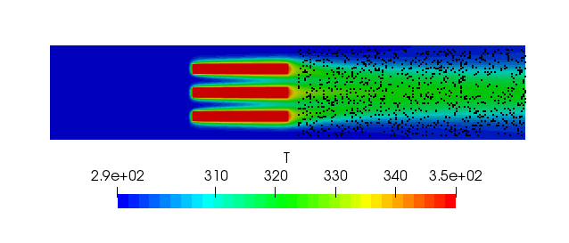

# Inverse PINN: Inferring PDE Coefficients from Data

This example demonstrates how to set up an *inverse* Physics-Informed Neural
Network (PINN) using PhysicsNeMo, `physicsnemo.sym`, and PyTorch. Given the
flow and temperature fields from an OpenFOAM heat-sink simulation, we recover
the unknown kinematic viscosity ($\nu$) and thermal diffusivity ($D$) that
generated the data, by enforcing the governing PDEs as soft constraints.

The goal of this example is to demonstrate the interoperability of
`physicsnemo`, `physicsnemo.sym`, and PyTorch in a custom training pipeline,
and to show how an inverse problem that previously required the
`physicsnemo-sym` `Solver`/`Domain`/`Constraint` abstractions can be expressed
as a short, explicit PyTorch training loop.

This example takes a non-abstracted approach: data loading, the forward pass
through the data-fit and inversion variables, the data-fitting loss, the
equation residual loss, and the optimizer step are all written out
explicitly. If you previously ran
the equivalent inverse problem in the (now archived)
[`physicsnemo-sym`](https://github.com/NVIDIA/physicsnemo-sym) repository
under the `Solver` / `Domain` / `Constraint` abstractions, see the
[PhysicsNeMo v2.0 Migration Guide](../../../v2.0-MIGRATION-GUIDE.md#physicsnemo-sym--physicsnemosym)
for the high-level mapping, plus the
[Migrating from PhysicsNeMo-Sym](#migrating-from-physicsnemo-sym) section
below for an inverse-problem-specific walkthrough.

## Problem overview

We want to infer two scalar PDE coefficients — kinematic viscosity $\nu$ and
thermal diffusivity $D$ — from observed fields ($u, v, p, T$) generated by an
OpenFOAM simulation of flow past a 2D heat sink. The training data is a
single CSV file sampled in the wake region of the heat sink (boundary points
are excluded so the loss only includes interior conservation laws).



Two networks are always trained to *memorize* the OpenFOAM data:

* `flow_net : (x, y) -> (u, v, p)` memorizes the velocity and pressure fields.
* `heat_net : (x, y) -> c` memorizes the scaled temperature.

For the *unknown coefficients* $\nu$ and $D$ this example supports two
different model classes — see [Choosing a model class for the unknown
coefficients](#choosing-a-model-class-for-the-unknown-coefficients) below.

The temperature is scaled to a transport variable $c$ before training:

<!-- markdownlint-disable MD013 MD049 -->
$$
c = \frac{T_{\text{actual}}}{T_{\text{base}}} - 1,
\qquad T_{\text{base}} = 293.498 \text{ K}.
$$

The training objective is

$$
\mathcal{L} =
\underbrace{
\mathrm{MSE}(\hat{u}, u) + \mathrm{MSE}(\hat{v}, v) +
\mathrm{MSE}(\hat{p}, p) + \mathrm{MSE}(\hat{c}, c)
}_{\text{data loss}}
\; + \;
\underbrace{
\| \mathcal{R}_{\text{NS}} \|^2 + \| \mathcal{R}_{\text{AD}} \|^2
}_{\text{physics loss}},
$$

where $\mathcal{R}_{\text{NS}}$ are the steady incompressible Navier–Stokes
residuals (continuity, $x$-momentum, $y$-momentum) and
$\mathcal{R}_{\text{AD}}$ is the steady advection–diffusion residual:

$$
\begin{aligned}
\mathcal{R}_{\text{cont}}    &= u_x + v_y, \\
\mathcal{R}_{\text{mom}_x}   &= u u_x + v u_y + p_x - \nu (u_{xx} + u_{yy}), \\
\mathcal{R}_{\text{mom}_y}   &= u v_x + v v_y + p_y - \nu (v_{xx} + v_{yy}), \\
\mathcal{R}_{\text{AD}}      &= u c_x + v c_y - D (c_{xx} + c_{yy}).
\end{aligned}
$$
<!-- markdownlint-enable MD013 MD049 -->

### The "inverse trick": detached graphs

The key idea that makes the inverse problem trainable is *detaching* the
flow/scalar variables (and their derivatives) inside the residual graphs:

* In the NS residuals, $u, v, p$ and their derivatives are **detached**, so
  gradients from the NS physics loss flow only into the $\nu$ inversion
  variable.
* In the AD residual, $u, v, c$ and their derivatives are **detached**, so
  gradients from the AD physics loss flow only into the $D$ inversion
  variable.

The flow and heat networks therefore learn to fit the OpenFOAM data, while
the inversion variables learn to make the residuals vanish — i.e. to infer
the $\nu$ and $D$ that explain the observed fields. In `physicsnemo.sym`
v2.x this is expressed by passing `detach_names=[...]` directly to the
`PhysicsInformer`.

## Choosing a model class for the unknown coefficients

The unknown coefficients $\nu$ and $D$ can be parameterised in two natural
ways, selected via the `inversion.mode` config knob:

* **`scalar`** (default): each coefficient is a single learnable parameter,
  represented in log-space (`nu = exp(log_nu)`, similarly for `D`). Use
  this when the unknown is a single constant — as it is in this OpenFOAM
  heat-sink dataset, where $\nu$ and $D$ are global properties of the
  fluid.
* **`field`**: each coefficient is an MLP `(x, y) → coefficient`, i.e. a
  spatial field. Use this when the unknown could vary in space, e.g.
  heterogeneous porous-media permeability or spatially varying reaction
  rates.

Switch with a Hydra CLI override:

```bash
python train_inverse_pinn.py inversion.mode=field
```

The two modes differ only in how `nu_pred` / `D_pred` are produced — the
rest of the training loop is identical. See the
`if inversion_mode == "scalar": ... else: ...` branch in
`train_inverse_pinn.py`.

In `field` mode the script reports the *standard deviation* of the
predicted coefficient over the batch alongside the mean — a small built-in
diagnostic for how spatially uniform the recovered field is.

## Getting started

### Prerequisites

If you are running this example outside of the PhysicsNeMo container, install
PhysicsNeMo with the sym extra:

```bash
pip install "nvidia-physicsnemo[sym]"
```

### Data

The OpenFOAM CSV (`heat_sink_Pr5_clipped2.csv`) is downloaded automatically
on the first run from the PhysicsNeMo NGC supplemental materials bucket. The
URL and target filename are configurable in `config.yaml` under `data:`.

### Training

```bash
python train_inverse_pinn.py
```

Default training settings (in `config.yaml`):

| Setting             | Value                                          |
| ------------------- | ---------------------------------------------- |
| Optimizer           | Adam                                           |
| Initial LR          | 1e-3                                           |
| LR schedule         | Exponential, decay rate 0.95 every 500 steps   |
| Batch size          | 1024                                           |
| Max steps           | 50,000                                         |
| `inversion.mode`    | `scalar` (also supported: `field`)             |
| `loss_weights.ns`   | 1.0                                            |
| `loss_weights.ad`   | 1.0                                            |

Training takes about ~30 minutes on a single modern NVIDIA GPU. Hydra logs
land in `outputs/`. Every `log_freq` steps the script prints the current
$\nu$ and $D$ alongside the data and per-residual physics losses — in
`scalar` mode these are exact scalar values, in `field` mode they are
reported as `mean ± std` over the batch.

## Results

After 50,000 steps with the default config (`inversion.mode = scalar`) we
recover coefficients close to the OpenFOAM ground truth:

| Property                                  | OpenFOAM (true) | PINN (predicted) |
| ----------------------------------------- | --------------- | ---------------- |
| Kinematic viscosity $\nu$ (m²/s)          | 1.00 × 10⁻²     | 1.02 × 10⁻²      |
| Thermal diffusivity $D$ (m²/s)            | 2.00 × 10⁻³     | 2.56 × 10⁻³      |

Switching to `inversion.mode = field` (an MLP-backed inversion network for
each coefficient, as in the original `physicsnemo-sym` example) and
training for 100,000 steps gives comparable results, reported as the
batch-wise `mean ± std` of the predicted field at the final step:

| Property                                  | OpenFOAM (true) | PINN (predicted, field) |
| ----------------------------------------- | --------------- | ----------------------- |
| Kinematic viscosity $\nu$ (m²/s)          | 1.00 × 10⁻²     | 9.87 × 10⁻³ ± 1.0 × 10⁻³ |
| Thermal diffusivity $D$ (m²/s)            | 2.00 × 10⁻³     | 2.40 × 10⁻³ ± 6 × 10⁻⁴   |

The dataset corresponds to a Prandtl number of 5 ($D = \nu/5$), so the
diffusion term $D \nabla^2 c$ is small compared to advection in the AD
residual. The residual is therefore less sensitive to $D$ than the NS
residual is to $\nu$, and the recovered $D$ has a larger relative error
($\sim 20\%$–$28\%$) than $\nu$ ($\sim 2\%$) under both model classes. The
same behaviour was reported for this case under the original
`physicsnemo-sym` implementation.

## Migrating from PhysicsNeMo-Sym

If you previously ran the equivalent example
([`examples/three_fin_2d/heat_sink_inverse.py`](https://github.com/NVIDIA/physicsnemo-sym/blob/main/examples/three_fin_2d/heat_sink_inverse.py))
in `physicsnemo-sym`, here is what changed in the migration to PhysicsNeMo
v2.0. The science is unchanged — only the API is leaner.

| Concern                  | Old (`physicsnemo-sym`)                                                    | New (`physicsnemo` + `physicsnemo.sym`)                          |
| ------------------------ | -------------------------------------------------------------------------- | ---------------------------------------------------------------- |
| Pre-built PDEs           | `from physicsnemo.sym.eq.pdes.navier_stokes import NavierStokes`           | Define the PDE inline as a `PDE` subclass with SymPy             |
| Network construction     | `instantiate_arch(..., cfg=cfg.arch.fully_connected)` + `Key("u")`         | `physicsnemo.models.mlp.fully_connected.FullyConnected` directly |
| Data ingestion           | `csv_to_dict` + `PointwiseConstraint.from_numpy(...)`                     | `numpy.genfromtxt` + a plain mini-batch loop                     |
| Residual / loss assembly | `make_nodes(detach_names=...)` + `Domain.add_constraint`                   | `PhysicsInformer(..., detach_names=...)` called explicitly       |
| Training loop            | `Solver(cfg, domain).solve()`                                              | Plain PyTorch `for step in range(...)` loop                      |
| Monitoring               | `PointwiseMonitor(..., metrics=...)`                                       | `PythonLogger` + `.item()` (scalar mode) or `.mean()/.std()` (field mode) |
| Configuration            | `physicsnemo.sym.hydra` (`PhysicsNeMoConfig`, `instantiate_arch`)         | Plain Hydra `@hydra.main` + a small `config.yaml`                |

## Additional reading

* [Forward LDC PINN example](../ldc_pinns/) — same non-abstracted style for a
  purely physics-driven (no data) problem.
* [Darcy Flow (DeepONet/FNO)](../darcy_physics_informed/) — physics informing
  data-driven operator models.
* [PhysicsNeMo v2.0 Migration Guide](../../../v2.0-MIGRATION-GUIDE.md).
