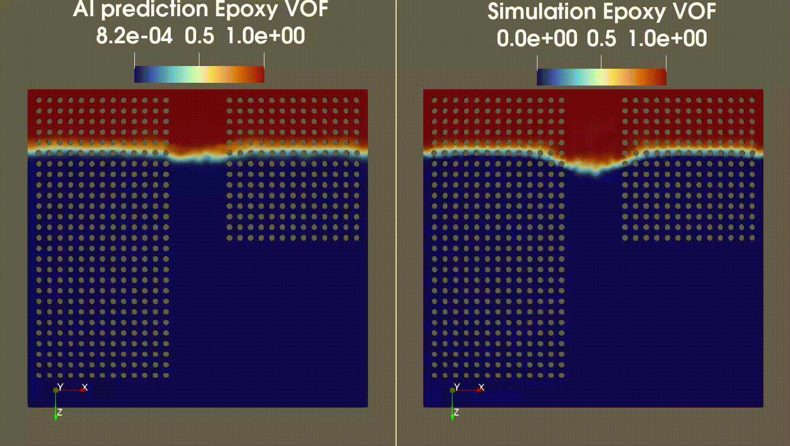
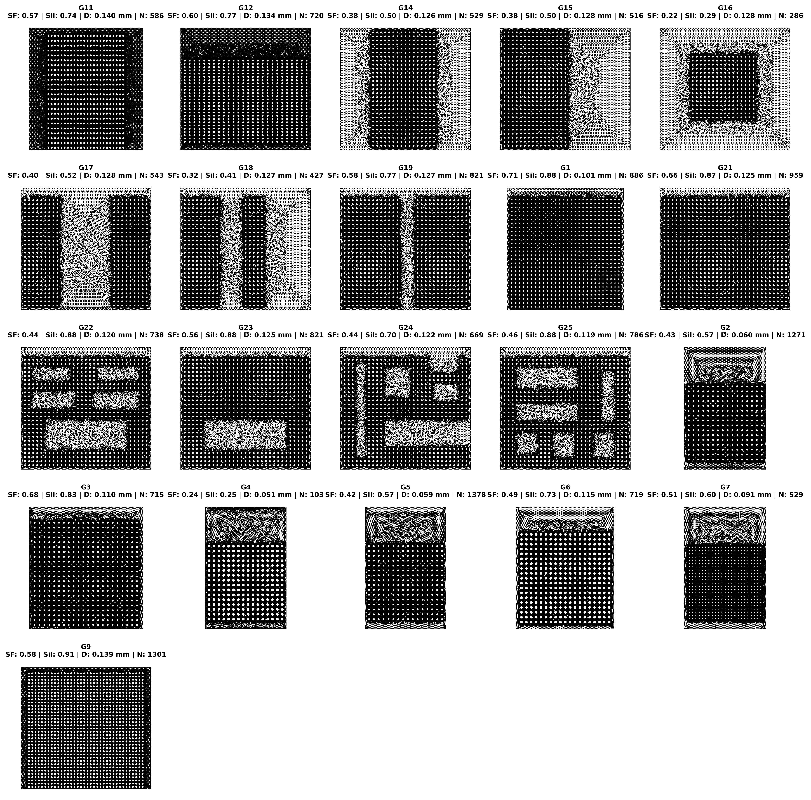
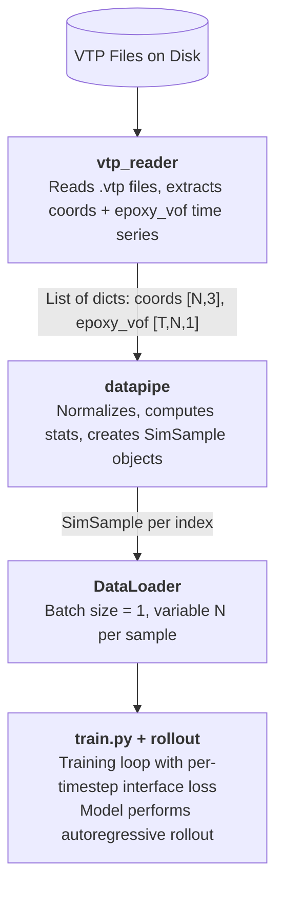

<!-- markdownlint-disable -->
# Transient Underfill Flow Prediction using GeoTransolver 🧪💧🔬

## Problem Overview

Automotive and semiconductor packaging rely on **capillary underfill** — liquid epoxy dispensed at one edge of a flip-chip assembly and drawn beneath the chip by capillary action. Predicting how the epoxy front advances over time traditionally requires expensive transient CFD simulations (e.g., ANSYS Fluent).

This recipe trains a **GeoTransolver** surrogate that learns the mapping directly from simulation data, enabling rapid prediction of the **Epoxy Volume-of-Fluid (VOF)** field across the full time horizon on static 3D meshes. The model:

- Takes the mesh geometry and initial VOF state as input
- Autoregressively rolls out future VOF states one timestep at a time
- Focuses training signal on the **fluid interface** where the physics is most dynamic

| Quantity | Description |
|---|---|
| **VOF = 0** | Cell is fully air (no epoxy) |
| **VOF = 1** | Cell is fully filled with epoxy |
| **0 < VOF < 1** | Cell is at the epoxy–air interface |

The **interface band** (where $0.01 \lt \text{VOF} \lt 0.99$) is the physically interesting region where the flow front advances. Bulk regions (fully filled or fully empty) are trivial and should not dominate the training loss.

---

The model was trained on a limited dataset comprising just 20 samples for training and 2 for validation/testing, targeting the epoxy Volume of Fluid (VOF) simulation. Despite the remarkably small dataset size, the model demonstrates a strong ability to accurately capture the interface dynamics. As illustrated in the animation below, the predicted interface evolution closely tracks the expected behavior, highlighting the model's data efficiency and generalization capability.

<p align="center">
  
  <br>
  <em>Predicted vs Ground Truth VOF interface evolution over 19 time steps</em>
</p>


The table below summarizes the model's performance across 19 autoregressive time steps. **Fill %** represents the percentage of the domain occupied by epoxy (VOF ≥ 0.5), while **MAE** and **RMSE** quantify the per-cell prediction error against the ground truth.

| Step | Pred Fill % | GT Fill % | MAE | RMSE |
|:----:|:-----------:|:---------:|:-------:|:-------:|
| t=1 | 24.7% | 25.2% | 0.01243 | 0.04910 |
| t=2 | 29.5% | 31.6% | 0.02136 | 0.07739 |
| t=3 | 34.2% | 37.1% | 0.02482 | 0.08044 |
| t=4 | 39.9% | 41.9% | 0.02181 | 0.07051 |
| t=5 | 44.1% | 46.2% | 0.01836 | 0.06124 |
| t=6 | 48.4% | 50.0% | 0.01859 | 0.05923 |
| t=7 | 52.5% | 53.8% | 0.01537 | 0.05151 |
| t=8 | 56.4% | 57.4% | 0.01560 | 0.05329 |
| t=9 | 59.7% | 60.6% | 0.01461 | 0.04989 |
| t=10 | 62.4% | 63.2% | 0.01488 | 0.04992 |
| t=11 | 64.9% | 65.8% | 0.01490 | 0.04892 |
| t=12 | 66.7% | 67.6% | 0.01426 | 0.04572 |
| t=13 | 68.3% | 69.1% | 0.01366 | 0.04367 |
| t=14 | 69.8% | 70.7% | 0.01405 | 0.04585 |
| t=15 | 71.4% | 72.1% | 0.01285 | 0.04219 |
| t=16 | 72.7% | 73.6% | 0.01410 | 0.04543 |
| t=17 | 74.0% | 74.9% | 0.01478 | 0.04581 |
| t=18 | 75.1% | 76.3% | 0.01666 | 0.05027 |
| t=19 | 76.4% | 77.5% | 0.01758 | 0.05143 |

**Column Descriptions:**
- **Step** — Autoregressive rollout time step.
- **Pred Fill %** — Predicted percentage of the domain filled with epoxy.
- **GT Fill %** — Ground truth fill percentage from the CFD simulation.
- **MAE** — Mean Absolute Error between predicted and ground truth VOF fields.
- **RMSE** — Root Mean Square Error between predicted and ground truth VOF fields.

> The model maintains low MAE (≤ 0.025) and RMSE (≤ 0.08) throughout all 19 time steps, with the predicted fill percentage closely tracking the ground truth (maximum deviation of ~2.9% at t=3). Errors remain stable and do not diverge over time, demonstrating robust autoregressive rollout even with a training set of only 20 samples.

## Dataset Diversity

The 21 simulation cases span a broad geometric envelope rather than minor
variants of a single configuration: solid fraction varies from 0.22 to 0.71,
equivalent hole diameter from 0.051 to 0.140 mm, and the spatial layout
ranges from uniform hole grids to asymmetric multi-void patterns. This
coverage is what allows the surrogate to generalize from only 20 training
samples.

<p align="center">
  
  <br>
  <em>X–Z projection of every simulation case, annotated with Solid
  Fraction (SF), Silhouette fraction (Sil, sanity check), mean hole
  diameter (D), and detected hole count (N).</em>
</p>

| Metric | Mean | Range | CV |
|---|---|---|---|
| Solid Fraction | 0.48 | 0.22 – 0.71 | 0.27 |
| Hole Diameter (mm) | 0.113 | 0.051 – 0.140 | 0.23 |
| Hole Count | 729 | 103 – 1378 | — |

The dataset achieves a **Composite Versatility Index of 0.31** — within the
*high-diversity* band (0.25 – 0.50) — meaning each training case contributes
substantively new geometric information rather than redundancy.

## Prerequisites

**Data**: Transient CFD simulation results exported as VTP files containing static mesh coordinates and time-varying `epoxy_vof` fields.

**Code dependencies**:

```bash
pip install -r requirements.txt
```
---

## Data Format

### Input: VTP Files

Each `.vtp` file represents **one simulation case** (one geometry configuration) and contains:

| Field | Shape | Description |
|---|---|---|
| `Points` | $[N, 3]$ | Static mesh node coordinates |
| `epoxy_vof_step00` | $[N]$ | VOF at timestep 0 |
| `epoxy_vof_step01` | $[N]$ | VOF at timestep 1 |
| ⋮ | ⋮ | ⋮ |
| `epoxy_vof_step19` | $[N]$ | VOF at timestep 19 |

Up to 20 timesteps per case (step00 through stepN).

### Directory Layout

**Training and validation** use a flat directory of VTP files — the reader
scans for all `.vtp` files directly under the configured path:

```bash
data/
├── train/            # flat: VTP files directly here
│   ├── G1.vtp
│   ├── G2.vtp
│   └── ...
└── val/              # flat: VTP files directly here
    ├── G24.vtp
    └── ...
```

**Inference (test)** expects each run in its own **subdirectory** — the
inference script scans for directories under `raw_data_dir_test` and
processes each one independently. Each subdirectory should contain the
VTP file(s) for that run:

```bash
data/test/            # parent directory set in config
├── G24/              # one subdirectory per run
│   └── G24.vtp
├── G25/
│   └── G25.vtp
└── ...
```
> **Why the difference?** Training loads all VTP files in bulk via the
> reader. Inference processes runs one at a time (with per-run output
> directories, statistics, and mesh-template lookup), so it needs the
> run-level directory structure for organization and provenance.

To convert a flat test directory to the expected layout:
```bash
# Quick conversion: wrap each VTP in its own subdirectory
cd data/test
for f in *.vtp; do
    name="${f%.vtp}"
    mkdir -p "$name"
    mv "$f" "$name/"
done
```

After conversion:
```bash
data/test/
├── G24/
│   └── G24.vtp
├── G25/
│   └── G25.vtp
└── ...
```

### Processed Sample (SimSample)
After the data pipeline processes a VTP file:
```bash
SimSample:
  node_features:
    "coords":   [N, 3]    # Normalized mesh coordinates (from t=0)
    "features": [N, 1]    # Normalized VOF at t=0
  node_target:   [N, T-1]  # Normalized future VOF (t=1 through t=T-1)

```

This is a point cloud representation (no graph edges). The Transolver uses attention over spatial slices instead of message passing.

---
## Architecture

```text
┌────────────────────────────────────────────────────────────────┐
│              TransolverAutoregressiveRollout                   │
│                                                                │
│   Input:  coords [N, 3]  +  vof_t [N, 1]                       │
│                                                                │
│   For each timestep t = 0, 1, ..., T-2:                        │
│   ┌───────────────────────────────────────────┐                │
│   │  1. Fourier Features(coords[:, [x,z]])    │ → [N, 12]      │
│   │  2. Concat [vof_t, coords, fourier]       │ → [N, 16]      │
│   │  3. GeoTransolver forward pass            │ → [N, 1]       │
│   │  4. Sigmoid activation                    │ → [N, 1]       │
│   │  5. vof_{t+1} = sigmoid(output)           │                │
│   └───────────────────────────────────────────┘                │
│                                                                │
│   Output: [T-1, N, 1]  predicted VOF at all future steps       │
└────────────────────────────────────────────────────────────────┘
```
### Why Sigmoid Activation?

VOF is a volume fraction that must lie in $[0, 1]$ by definition. The sigmoid function $\sigma(x) = 1/(1+e^{-x})$ maps any real-valued model output to this range, providing two guarantees:

1. **Physical validity** — The model cannot produce negative fill or fill > 100%, regardless of what the transformer outputs.

2. **Stable autoregressive rollout** — Each step's output becomes the next step's input. Without bounding, small errors compound and diverge across steps. Sigmoid keeps every intermediate state in $[0, 1]$.

We prefer sigmoid over post-hoc clamping because clamping has zero gradient at the boundaries — the model cannot learn to correct saturated predictions. Sigmoid always provides learning signal.


## Input Feature Composition

The functional input dimension is **16**:

| Component | Dimension | Description |
|---|---|---|
| `vof_t` | 1 | Current VOF state |
| `coords` | 3 | Normalized (x, y, z) coordinates |
| `fourier` | 12 | Fourier features of (x, z) with 3 frequencies × 2 coords × 2 (sin+cos) |
| **Total** | **16** | `functional_dim` in config |

---
## Training
Training is managed via Hydra configurations located in conf/. The main script is train.py.

### Config Structure

```bash
conf/
├── config.yaml                    # Hydra root config
├── training/
│   └── default.yaml               # Training hyperparameters
├── model/
│   └── transolver_autoregressive_rollout_training.yaml
└── reader/
    └── default.yaml               # VTP reader config

```
### Launch Training
- Single GPU:
```bash
python train.py

```
- Multi-GPU (Distributed Data Parallel):
```bash
torchrun --nproc_per_node=<NUM_GPUS> train.py
```
### Training Loop (per epoch)

```text
For each sample in dataloader:
    1. Move sample to GPU
    2. Forward: model rolls out T-1 steps on ALL nodes
    3. Loss: compute per-timestep interface MSE
    4. Backward: gradients flow only through interface nodes
    5. Optimizer step with gradient clipping (max_norm=25)

Scheduler step (cosine annealing with warm restarts)

```
The forward pass always processes all nodes so that the transformer has full spatial context for its attention mechanism. Masking is applied only in the loss computation, meaning bulk nodes see zero gradient contribution.

### Per-Timestep Interface Loss

At each rollout step $t$, the loss is computed **only** on nodes within the interface band as determined from the ground-truth VOF at that step:

$$\mathcal{L}_t = \frac{1}{|\mathcal{M}_t|} \sum_{i \in \mathcal{M}_t} \left( \hat{y}_{t,i} - y_{t,i} \right)^2$$

where $\mathcal{M}_t = \{i : \text{vof\_lo} < y_{t,i} < \text{vof\_hi}\}$ is the per-timestep interface mask. The total loss averages across all timesteps that contain at least one interface node:

$$\mathcal{L} = \frac{1}{T_{\text{valid}}} \sum_{t=1}^{T-1} \mathcal{L}_t$$

If a timestep has no interface nodes, it is skipped entirely. In the degenerate case where **no** timestep has interface nodes, the loss falls back to full-domain MSE. The method also returns the average percentage of nodes in the interface band, which is logged for monitoring.

This design ensures that bulk nodes (VOF $\approx$ 0 or VOF $\approx$ 1), which constitute 80–95% of the domain, produce **exactly zero gradient** rather than being merely down-weighted.

### Logging

| Metric | TensorBoard Tag | Description |
|---|---|---|
| Training loss | `train/loss` | Epoch-averaged interface MSE |
| Interface % | `train/interface_pct` | Average percentage of nodes in interface band |
| Learning rate | `train/learning_rate` | Current LR |
| Validation MSE | `val/MSE` | Full-domain MSE |
| Validation interface MSE | `val/MSE_interface` | Interface-only MSE |
| Per-timestep MSE | `val/tXX_MSE` | MSE at each rollout step |

---
## Configuration Reference

`conf/training/default.yaml`

```yaml
# Data
raw_data_dir: "/path/to/train_data"
raw_data_dir_validation: "/path/to/val_data"
debug: False


# Training
epochs: 601
num_time_steps: 10          # T total (rollout = T-1 = 9 steps)
amp: true
start_lr: 0.0002
end_lr: 0.000001
scheduler_T0: 50       # restart period in epochs (first cycle length)
scheduler_T_mult: 2    # multiply period by this factor after each restart
num_samples: 23             # Training samples
num_validation_samples: 4

# Interface mask configuration
interface_mask:
  vof_lo: 0.01
  vof_hi: 0.99
  band_fraction: 0.05          # 0 = no fractional dilation
  absolute_expansion: 0     # 0 = core interface only
  interface_axis: -1         # Auto-detect

# Checkpointing
save_chckpoint_freq: 25
validation_freq: 25

```
`debug` in the training config flows into two `datapipe.py` and `vtp_reader.py`. Set it to True only during initial data validation or when debugging a new dataset. For production training runs, keep it False — the verbose print() output is redundant with the logger and clutters stdout, especially in multi-GPU runs where every rank prints.


`conf/model/transolver_autoregressive_rollout_training.yaml`

```yaml
_target_: rollout.TransolverAutoregressiveRollout

functional_dim: 16    # 1 (VOF) + 3 (coords) + 12 (Fourier)
out_dim: 1            # Predict VOF only
geometry_dim: 3       # 3D mesh
slice_num: 64         # Transolver spatial slices
n_layers: 5           # Transformer layers
num_time_steps: ${{training.num_time_steps}}
dt: 5e-3

```

---

## Reader: VTP Reader and How to Add Your Own

The reader (`vtp_reader.py`) opens preprocessed simulation data and produces the arrays the datapipe consumes. It is swappable via **Hydra** so you can adapt the pipeline to different formats.

---

### Built-in VTP Reader
A lightweight VTP reader is provided in `vtp_reader.py`. It treats each `.vtp` file in a directory as a separate simulation run and expects the epoxy VOF time series to be stored as scalar arrays in `point_data` with names like `epoxy_vof_step00`, `epoxy_vof_step01`, etc. 

**The reader:**
* **Loads reference coordinates** from `mesh.points` as $[N, 3]$.
* **Extracts all matching** `epoxy_vof_step*` fields sorted by step index.
* **Stacks them** into a time series array $[T, N, 1]$.
* **Returns a list of dictionaries**, each containing `"coords"` and `"epoxy_vof"`.

Two naming conventions are supported: `epoxy_vof_step00` and `epoxy_vof_00`. Coordinates are stored as `float64` for precision.

| Function | Description |
| :--- | :--- |
| `find_vtp_files(base_data_dir)` | Finds and naturally sorts all `.vtp` files in a directory. |
| `load_vtp_file(vtp_path, debug)` | Loads a single VTP file; returns coordinates $[N, 3]$ and fields dict. |
| `process_vtp_data(...)` | Batch-processes all VTP files in a directory. |

---


## Rollout: Autoregressive Model Wrapper

The rollout module (`rollout.py`) extends `GeoTransolver` with autoregressive rollout capability and provides the interface band computation used by the loss function.

---

### TransolverAutoregressiveRollout
**Forward Pass Logic:**

For $t = 0$ to $T-2$:
1. **Compute Fourier features** from `coords[:, [0, 2]]` (x and z).
2. **Concatenate:** $[vof_t, coords, fourier] \to [N, 16]$.
3. **Pass through** `GeoTransolver` backbone.
4. **Apply sigmoid** $\to vof_{t+1}$.
5. **Feed** $vof_{t+1}$ back as input for the next step.

**Return:** Stacked predictions $[T-1, N, 1]$.

#### Constructor Parameters
*(Popped from `kwargs` before passing to parent)*

| Parameter | Default | Description |
| :--- | :--- | :--- |
| `dt` | $5e^{-3}$ | Physical timestep size. |
| `num_time_steps` | 20 | Total timesteps (rollout = $T-1$). |
| `num_fourier_frequencies` | 3 | Number of Fourier frequency bands. |
| `fourier_base` | 1 | Base frequency for Fourier encoding. |

---

### compute_interface_band
Computes a boolean mask selecting nodes near the VOF interface:

```python
band = compute_interface_band(
    vof,               # [N] or [N, 1]
    coords,            # [N, 3]
    vof_lo=0.01,       # Lower VOF threshold
    vof_hi=0.99,       # Upper VOF threshold
    band_fraction=0.05,
    absolute_expansion=None,
)
# Returns: [N] boolean mask
```
| Parameter | Default | Description |
|---|---|---|
| `vof_lo` | 0.01 | Lower VOF threshold for interface-core detection |
| `vof_hi` | 0.99 | Upper VOF threshold for interface-core detection |
| `band_fraction` | 0.05 | Expand the band by this fraction of the domain extent along the detected axis. Only used when `absolute_expansion` is `null`. |
| `interface_axis` | -1 | Axis for band expansion (-1 = auto-detect as the axis with smallest interface spread) |
| `absolute_expansion` | null | If set to a float, overrides `band_fraction` with an explicit expansion in coordinate units. Set to `null` to use `band_fraction` instead. |


### Algorithm:
1. **Find core interface nodes** where $\mathrm{vof\_lo} < \mathrm{VOF} < \mathrm{vof\_hi}$.
2. **Auto-detect the interface-normal axis** (the axis with the smallest interface spread).
3. **Compute the coordinate range** of interface nodes along that axis: $[z_{\min}, z_{\max}]$.
4. **Expand** by `absolute_expansion` (or `band_fraction` $\times$ `domain_extent`).
5. **Select all nodes** within the expanded band.

> **Note:** This expansion ensures that the loss function captures the "movement" of the interface, providing gradients even if the predicted interface is slightly offset from the ground truth.


## Pipeline Overview




## Directory Structure
```bash
Underfill/
├── README.md                          # Project documentation
├── conf/                              # Hydra configuration root
│   ├── config.yaml                    # Top-level Hydra config (selects defaults)
│   ├── datapipe/                      # Dataset configuration variants
│   │   ├── graph.yaml                 # Graph-based datapipe (for MeshGraphNet, unused currently)
│   │   └── point_cloud.yaml           # Point-cloud datapipe (for GeoTransolver)
│   ├── inference/                     # Inference settings
│   │   └── default.yaml               # Output paths, VTP prefix, error flags
│   ├── model/                         # Model architecture configs
│   │   └── transolver_autoregressive_rollout_training.yaml  # GeoTransolver rollout model
│   ├── reader/                        # Data reader configs
│   │   └── vtp.yaml                   # VTP reader (field_name, debug flag)
│   └── training/                      # Training hyperparameters
│       └── default.yaml               # Epochs, LR, scheduler, interface mask, paths
├── datapipe.py                        # Dataset class, normalization, SimSample container
├── inference.py                       # Inference script: rollout + save predicted VTPs
├── inference.py                 # Post-hoc error analysis on inference outputs
├── outputs/                           # Hydra auto-generated output directory (logs, configs)
├── rollout.py                         # Autoregressive model wrapper + interface band computation
├── train.py                           # Training loop, loss, optimizer, validation
└── vtp_reader.py                      # VTP file I/O (PyVista-based, generic field discovery)


```

## Inference

Use `inference.py` to evaluate a trained model on test data. The script loads a checkpoint, runs autoregressive rollout on each test case, and writes per-timestep VTP files with predicted VOF fields for visualization in ParaView.

### Launch Inference

Single GPU:

```bash
python inference.py
```

### How It Works

The `InferenceWorker` loads the trained checkpoint and processes each test run independently:

1. **Scanning:** The test data directory is scanned for subdirectories — each subdirectory is considered one simulation run.
2. **Distribution:** Runs are distributed across ranks. Rank $r$ processes `run_dirs[r::world_size]`.
3. **Data Loading:** For each run, a temporary single-sample dataset is constructed via the same `datapipe` used in training, ensuring identical normalization statistics are applied.
4. **Inference:** The model performs a full autoregressive rollout on all nodes (no interface masking at inference time).
5. **Denormalization:** Predictions and coordinates are **denormalized** back to physical units.
6. **Saving:** Per-timestep VTP files are saved under `output_dir/rank{N}/{run_name}/`, each containing the following arrays:

| Point Data Field | Description |
| :--- | :--- |
| `epoxy_vof_pred` | Predicted VOF at this timestep |
| `epoxy_vof_exact` | Ground-truth VOF (if available) |
| `epoxy_vof_error` | Signed error (pred − exact) |
| `epoxy_vof_abs_error` | Absolute error |

---

### Error Reporting
The script computes and prints per-timestep statistics in a formatted table, including prediction mean, standard deviation, value range, fill percentage (VOF > 0.5), and — when ground truth is available — MAE and RMSE. An overall summary is printed at the end of each run
