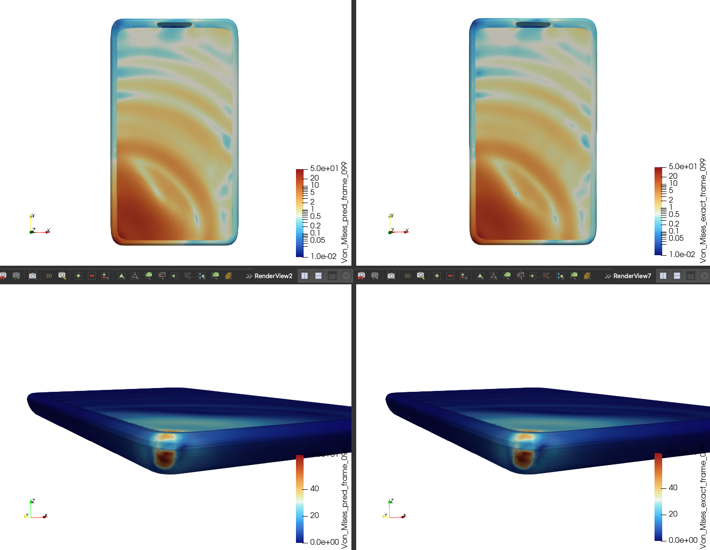

<!-- markdownlint-disable -->
# Machine Learning Surrogate for Drop-Test Dynamics 📱📉

## Problem Overview

Drop-test simulation is a standard qualification step for consumer electronics, packaging, and other components that must survive impact loading. Engineers run high-fidelity explicit finite-element simulations (e.g., OpenRadioss, LS-DYNA) on solid-element meshes to predict how a product deforms when it hits a rigid wall and how internal stresses concentrate. These simulations are accurate but expensive, which limits the number of material and orientation variants that can be explored in a design cycle.

This recipe trains a machine learning surrogate that predicts the full drop-test response from the initial geometry and per-run scenario parameters. Given a tetrahedral/hexahedral mesh at `t=0` plus a scalar vector describing materials and rigid-wall orientation, the model predicts the displacement field over the entire drop trajectory and the per-node Von Mises stress at every timestep in a single forward pass (one-shot rollout). Once trained, a surrogate evaluates a new design in seconds instead of minutes.

The implementation uses a GeoTransolver backbone with one-shot training and is configured via Hydra experiment configs so new datasets, feature sets, or hyperparameters can be introduced without touching the core code.

<p align="center">
  
</p>

## Prerequisites

**Data:** OpenRadioss drop-test data preprocessed into VTU format using [PhysicsNeMo-Curator](https://github.com/NVIDIA/physicsnemo-curator/tree/main/examples/structural_mechanics/drop_test). See [Data Preprocessing](#data-preprocessing) below.

**Code dependencies:**

```bash
pip install -r requirements.txt
```

GeoTransolver lives under `physicsnemo.experimental.models`, so a standard PhysicsNeMo install is sufficient — no extras required.

## Data Preprocessing

OpenRadioss does not emit a single per-run file; it produces one VTK file per timestep via `anim_to_vtk`. PhysicsNeMo-Curator's `drop_test` recipe reads those per-timestep VTKs, stacks them into a single position trajectory, filters rigid-wall nodes, builds mesh connectivity, and writes one VTU file per run that this example can consume directly.

Expected Curator input layout:

```
input_dir/
├── run0001/
│   ├── Cell_Phone_DropA001.vtk
│   ├── Cell_Phone_DropA002.vtk
│   └── ...
├── run0002/
│   └── ...
└── ...
```

Run the Curator ETL:

```bash
python run_etl.py                                                   \
    --config-dir=examples/structural_mechanics/drop_test/config     \
    --config-name=drop_test_etl                                     \
    etl.source.input_dir=/path/to/openradioss_runs/                 \
    serialization_format=vtu                                        \
    serialization_format.sink.output_dir=/path/to/drop_test/vtu/    \
    etl.processing.num_processes=4
```

This produces one VTU per run:

```
drop_test_processed/
├── run0001.vtu
├── run0002.vtu
└── ...
```

Each VTU is an `UnstructuredGrid` (tet/hex) containing:
- Reference coordinates at `t=0`
- Displacement fields `displacement_t0.000`, `displacement_t0.005`, ... (one per timestep)
- Per-node stress fields (e.g., `Von_Mises`) at each timestep

### Global features JSON

Per-run scalar conditioning (material scales, rigid-wall orientation) is stored in a separate JSON file shared across splits. See [Global features](#global-features) for the file format and how it is consumed.

### Expected dataset layout

```
drop_test/processed/
├── train/
│   ├── run0001.vtu
│   ├── run0002.vtu
│   └── ...
├── val/
│   ├── run0037.vtu
│   └── ...
└── global_features.json
```

## Training

Training is managed via Hydra. The entry point is `train.py` and the provided experiment config is `conf/drop_test_geotransolver_oneshot.yaml`.

### Launch training

Single GPU:

```bash
python train.py --config-name=drop_test_geotransolver_oneshot
```

Multi-GPU (Distributed Data Parallel):

```bash
torchrun --nproc_per_node=<NUM_GPUS> train.py --config-name=drop_test_geotransolver_oneshot
```

Override data paths from the command line if your dataset lives somewhere other than the default:

```bash
python train.py --config-name=drop_test_geotransolver_oneshot \
    training.raw_data_dir=/my/data/drop_test/train             \
    training.raw_data_dir_validation=/my/data/drop_test/val    \
    training.global_features_filepath=/my/data/drop_test/global_features.json
```

Hydra writes run artefacts (checkpoints, tensorboard logs, run config, `log.log`) under `./outputs/` by default.

## Inference

`inference.py` evaluates a trained checkpoint on a set of test VTU files and writes, for each run, a single comparison VTU containing predicted, exact, and `predicted - exact` fields on the exact mesh.

Single GPU:

```bash
python inference.py --config-name=drop_test_geotransolver_oneshot
```

Multi-GPU:

```bash
torchrun --nproc_per_node=<NUM_GPUS> inference.py --config-name=drop_test_geotransolver_oneshot
```

Runs are sharded across ranks (`run_items[r::world_size]`). Output path defaults to `./single_vtu_output/rank{N}/{run_name}_comparison.vtu` and can be changed via `inference.output_dir_single_vtu`. The comparison VTUs can be opened directly in ParaView.

## Config layout

```
conf/
├── drop_test_geotransolver_oneshot.yaml   # self-contained experiment config
├── datapipe/
│   ├── graph.yaml
│   └── point_cloud.yaml
├── model/
│   └── geotransolver_one_shot.yaml
├── reader/
│   └── vtu.yaml
├── training/default.yaml
└── inference/default.yaml
```

Each experiment config is self-contained: it selects defaults for reader, datapipe, model, training, and inference and sets experiment-specific fields (data paths, dataset sizes, feature lists, any model overrides) directly.

### Anatomy of the drop-test config

```yaml
# conf/drop_test_geotransolver_oneshot.yaml

experiment_name: "DropTest-GeoTransolver"

defaults:
  - reader: vtu
  - datapipe: point_cloud
  - model: geotransolver_one_shot
  - training: default
  - inference: default
  - _self_

training:
  raw_data_dir: /code/datasets/drop_test/processed/train
  raw_data_dir_validation: /code/datasets/drop_test/processed/val
  global_features_filepath: /code/datasets/drop_test/processed/global_features.json
  optimizer: adam
  grad_clip_norm: 10.0
  num_time_steps: 100
  num_training_samples: 20
  num_validation_samples: 4

inference:
  raw_data_dir_test: /code/datasets/drop_test/processed/val

datapipe:
  static_features: []               # solid elements have no thickness
  dynamic_targets: [Von_Mises]      # per-node stress target
  log_transform_targets: true       # log1p on targets, expm1 at inference
  global_features:
    - e_scale_mat1
    - e_scale_mat4
    - e_scale_mat5
    - e_scale_mat8
    - e_scale_mat9
    - rwall_orientation_rx
    - rwall_orientation_ry
    - rwall_orientation_rz
  sample_type: all_time_steps

model:
  functional_dim: 3   # coords only (no static node features)
  out_dim: 396        # (num_time_steps - 1) * (3 positions + 1 stress) = 99 * 4
  global_dim: 8       # must equal len(datapipe.global_features)
  n_layers: 5
```

The `out_dim` value is tied to `num_time_steps` and the number of output channels. For the one-shot scheme, `out_dim = (num_time_steps - 1) * (3 + sum(C_k))`, where `C_k` is the per-target channel count (`Von_Mises` contributes 1). Changing either horizon or target set requires updating `out_dim` accordingly.

### Other available model configs

Only `drop_test_geotransolver_oneshot.yaml` is provided as a ready-to-run experiment, but `conf/model/` ships defaults for additional rollout classes defined in `rollout.py`:

| Config | Class | Scheme |
|---|---|---|
| `geotransolver_one_shot.yaml` | `GeoTransolverOneShot` | one-shot (provided experiment) |
| `geotransolver_time_conditional.yaml` | `GeoTransolverTimeConditional` | time-conditional |
| `geotransolver_autoregressive_rollout_training.yaml` | `GeoTransolverAutoregressiveRolloutTraining` | autoregressive rollout |
| `geotransolver_one_step_rollout.yaml` | `GeoTransolverOneStepRollout` | one-step rollout |
| `transolver_one_shot.yaml` | `TransolverOneShot` | one-shot |
| `mgn_one_shot.yaml` | `MeshGraphNetOneShot` | one-shot (requires `datapipe: graph`) |
| `figconvunet_one_shot.yaml` | `FIGConvUNetOneShot` | one-shot |

These have **not been validated on drop-test data**. To try one, write a new experiment config following the template above, select the model in `defaults`, set `datapipe.sample_type` (`one_time_step` for time-conditional, `all_time_steps` otherwise), and override `out_dim` / `functional_dim` / `global_dim` to match drop-test output cardinality.

### Adding a new experiment

1. Copy `conf/drop_test_geotransolver_oneshot.yaml` to `conf/<my_experiment>.yaml`.
2. Adjust `training.raw_data_dir*`, `training.global_features_filepath`, and `inference.raw_data_dir_test` to point at your dataset (or use `???` and pass via CLI).
3. Set `training.num_time_steps`, `training.num_training_samples`, `training.num_validation_samples` to match your dataset.
4. Edit `datapipe.dynamic_targets`, `datapipe.global_features`, and `datapipe.static_features` to match what your VTUs and global-features JSON provide.
5. Update `model.out_dim = (num_time_steps - 1) * (3 + sum(C_k))` and `model.global_dim = len(datapipe.global_features)`.
6. Run: `python train.py --config-name=<my_experiment>`.

## Datapipe: how inputs, targets, and global conditioning are constructed

The datapipe converts reader output into model-ready `SimSample`s. Each sample is one run (one VTU file).

### Inputs and targets

- `x['coords']`: `[N, 3]` reference coordinates at `t=0`.
- `x['features']`: `[N, F]` per-node static features; empty (`F=0`) for this recipe because solids have no thickness.
- `y`: `[N, T-1, Fo]` per-node target trajectory, where `T = num_time_steps` and `Fo = 3 + sum(C_k)`. The first three output channels are always positions `(x, y, z)` (model predicts positions and the rollout code adds back the initial `coords`); the remaining channels are the flattened `dynamic_targets` (here a single channel for `Von_Mises`).

The train/validation stats for positions and features are computed on the train split, saved to `./stats/` (`node_stats.json`, `feature_stats.json`), and reused at validation and inference. Deleting `./stats/` on a clean run forces recomputation.

### Log-transforming stress targets

`Von_Mises` stress spans several orders of magnitude within a single run. Setting `datapipe.log_transform_targets: true` applies `torch.log1p(t.clamp(min=0.0))` to every field listed in `dynamic_targets` before normalization. At inference, `inference.py` applies the inverse (`expm1`) after denormalization so that saved VTUs are in physical units. If you change `dynamic_targets`, make sure all listed fields are non-negative, or disable `log_transform_targets`.

### sample_type

This recipe uses `sample_type: all_time_steps` — one `SimSample` per run, target is the full trajectory `[N, T-1, Fo]`, dataset length equals `num_training_samples`. The alternative (`one_time_step`) targets a per-timestep time-conditional model; it is not used in this example.

### Global features

Per-run scalar conditioning (material elasticity scales, rigid-wall orientation) is loaded from a single JSON file shared across splits. The file is a flat dictionary keyed by **run ID**, where each value is a dictionary of `{feature_name: scalar_float}`:

```json
{
  "run0001": {
    "e_scale_mat1": 1.0,
    "e_scale_mat4": 0.9,
    "e_scale_mat5": 1.1,
    "e_scale_mat8": 1.0,
    "e_scale_mat9": 1.0,
    "rwall_orientation_rx": 0.0,
    "rwall_orientation_ry": 15.0,
    "rwall_orientation_rz": 0.0
  },
  "run0002": { "...": "..." }
}
```

**Run ID convention:** the run ID must match the **filename stem** of the VTU file — `run0001.vtu` maps to `"run0001"`.

The `global_features` list in the datapipe config selects which keys to use and fixes their order in the global embedding vector. Every run must have all listed keys; missing keys raise `KeyError` at dataset construction time. Additional keys in the JSON are silently ignored, so the file can store metadata beyond what training consumes.

The `global_dim` parameter in the model config must equal `len(datapipe.global_features)`. For this recipe that is `8` (five material scales plus three rigid-wall orientation angles).

## Reader: VTU for drop test

A VTU reader is provided in `vtu_reader.py`. It expects one `UnstructuredGrid` VTU per run in `<DATA_DIR>/`, with:

- Reference coordinates in `mesh.points`.
- Displacement vector fields in `mesh.point_data` named `displacement_t0.000`, `displacement_t0.005`, ... (regex-matched and naturally sorted). A fallback to any `displacement_t*` pattern is supported.
- Per-node dynamic fields (e.g., `Von_Mises`) whose names match `datapipe.dynamic_targets`.
- Optionally, any other per-node arrays (velocity, acceleration, temperature, residual forces, etc.) whose names can be listed under `datapipe.static_features` if you want them as model inputs.

The reader stacks per-timestep positions as `[t0: coords, t>0: coords + displacement_t]`, extracts cell connectivity (for the graph datapipe, if selected), pulls non-displacement point-data fields, and returns `(srcs, dsts, point_data)` where `point_data['coords']` has shape `[T, N, 3]` plus one entry per extracted feature.

Hydra config:

```yaml
# conf/reader/vtu.yaml
_target_: vtu_reader.Reader
_convert_: all
```

### Bring your own reader

The reader contract is format-agnostic: any Hydra-instantiable callable that returns `(srcs, dsts, point_data)` with `point_data['coords']: [T, N, 3]` and any additional per-node feature arrays will plug in without code changes.

A minimal reader class has the form:

```python
# my_reader.py
class MyReader:
    def __init__(self, some_option: float = 1.0):
        self.some_option = some_option

    def __call__(
        self,
        data_dir: str,
        num_samples: int,
        split: str | None = None,
        logger=None,
        **kwargs,
    ):
        # return (srcs, dsts, point_data)
        ...
```

Point your config at it:

```yaml
# conf/reader/my_reader.yaml
_target_: my_reader.MyReader
```

and select `reader: my_reader` in the experiment config's `defaults` block. Keeping a `**kwargs` catch-all keeps your reader forward-compatible with future optional arguments.

## TODO

- [ ] **Normalize global features**: Global features (material scales, rigid-wall orientation) are currently passed to the model unnormalized. Add per-feature mean/std (or similar) so global inputs are consistent with normalized positions.
- [ ] **Support batch_size > 1**: The pipeline uses `batch_size=1` because node counts vary across runs. Add padding or ragged batching to improve throughput.
- [ ] **Richer inference metrics**: `inference.py` currently saves comparison VTUs only. A structured per-run / aggregate metric report (normalized MSE, physical RMSE / MAE / relative L², per-timestep curves, CSV export) would make run-to-run comparison easier.

## Troubleshooting / FAQ

- **My VTU has no `displacement_t*` fields.** Ensure the Curator ETL wrote them. The reader expects vector arrays named `displacement_t0.000`, `displacement_t0.005`, ...; a fallback to any `displacement_t*` is used if the strict pattern doesn't match.
- **`KeyError` on a run ID when the dataset is built.** The run ID (VTU filename stem) is missing from the global features JSON, or is missing one of the keys listed under `datapipe.global_features`.
- **`out_dim` mismatch / assertion in rollout.** Check that `model.out_dim = (num_time_steps - 1) * (3 + sum(C_k))`, where `C_k` is the per-target channel count.
- **Stress predictions look clipped to zero.** `log_transform_targets: true` clamps negatives to zero before `log1p`. If your dataset has meaningful negative values (it shouldn't for Von Mises), disable the log transform.
- **Custom reader doesn't accept `split` or `logger`.** Implement `__call__(..., split: str | None = None, logger=None, **kwargs)` for forward compatibility.

## References

- [GeoTransolver: Learning Physics on Irregular Domains Using Multi-scale Geometry Aware Physics Attention Transformer](https://arxiv.org/pdf/2512.20399)
- [Transolver: A Fast Transformer Solver for PDEs on General Geometries](https://arxiv.org/pdf/2402.02366)
- [OpenRadioss — Open-source explicit finite-element solver](https://www.openradioss.org/)
