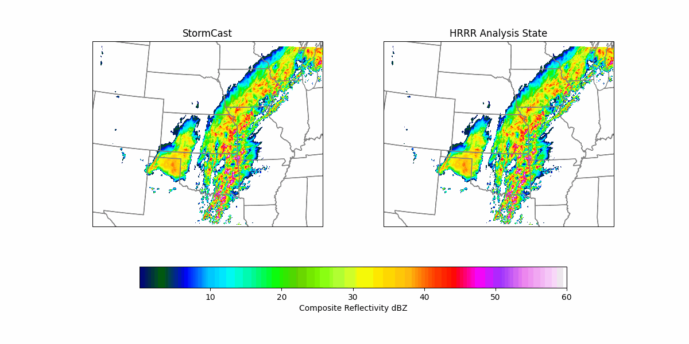

<!-- markdownlint-disable -->
# Regional High-Resolution Weather Models using Generative Diffusion

## Problem Overview

Convection-allowing models (CAMs) are essential tools for forecasting severe thunderstorms and
mesoscale convective systems, which are responsible for some of the most extreme weather events.
By resolving kilometer-scale convective dynamics, these models provide the precision needed for
accurate hazard prediction. However, modeling the atmosphere at this scale is both challenging
and expensive with traditional numerical weather prediction.

This example provides a toolkit for training and simple inference for regional AI high-resolution models
using diffusion. Examples of the types of models that can be trained with it include:

- [StormCast](https://arxiv.org/abs/2408.10958),
a generative diffusion model designed to emulate NOAA’s High-Resolution Rapid Refresh (HRRR) model, a 3km
operational CAM. StormCast autoregressively predicts multiple atmospheric state variables with remarkable
accuracy, demonstrating ability to replicate storm dynamics, observed radar reflectivity, and realistic
atmospheric structure through deep learning-based CAM emulation. StormCast enables high-resolution ML-driven
regional weather forecasting and climate risk analysis.

<p align="center">

</p>

- [Stormscope](https://arxiv.org/abs/2601.17268),
a nowcasting/nearcasting model for clouds and precipitation, using GOES satellite radiances and MRMS
radar measurements as training data. Stormscope's generative model architecture allows the uncertainty of
the predicted variables to be accurately quantified.


The design of StormCast relies on two UNet-type neural networks:

- A regression model, which provides a deterministic estimate of the next HRRR timestep given the previous timestep's HRRR and background ERA5 states.
- A diffusion model, which is given the previous HRRR timestep as well as the estimate from the regression model, and provides a correction to the regression model estimate to produce a final high-quality prediction of the next high-resolution atmospheric state.
The regression and diffusion components are trained separately (with the diffusion model training requiring a regression model as prerequisite), then coupled together in inference.

Meanwhile, Stormscope omits the regression model in favor of a diffusion-only approach using a diffusion transformer (DiT) architecture.

These models can make longer forecasts (more than one timestep) during inference by feeding their predictions back into the model as input for the next step (autoregressive rollout). Both models can be formulated in terms of a high-resolution state update guided by a low-resolution conditioning. In the code, we refer to the high-resolution state in generic terms as `state` and to the low-resolution data source as `background`.

## Getting Started

### Preliminaries

1. Install PhysicsNeMo (if not already installed) with the `datapipes-extras`, `nn-extras`, and `utils-extras` optional dependency groups, along with the packages in `requirements.txt`. 
2. Copy this folder (`examples/weather/stormcast`) to a system with a GPU available. 
3. Prepare a combined HRRR/ERA5 dataset in the form specified in `datasets/data_loader_hrrr_era5.py` or implement a custom dataset class as shown below under [Adding custom datasets](#adding-custom-datasets).

PyTorch 2.10 or higher is recommended for this recipe and is _required_ to use domain parallelism. Tests using domain parallel features will likely fail with older PyTorch versions. 

To install all requirements beyond those of PhysicsNeMo itself, you can run:

```bash
pip install -r requirements.txt
```

### Testing

To test the functionality of the training code, you can run the `pytest` test suite in `test_training.py` in a single-GPU or multi-GPU environment. 

To run the single-GPU tests, run:

```bash
pytest test_training.py
```

No failing tests indicates that the training environment is functional. It is normal for many tests to be skipped because not all parameter combinations are supported and some tests are meant to be run with multiple GPUs. Multi-GPU tests need to be run using `torchrun`, with tests of 1, 2, and 4 GPUs included. For instance, to run all 2-GPU tests:

```bash
torchrun --standalone --nproc_per_node=2 --no-python pytest test_training.py
```

The multi-GPU tests might produce some clutter because all processes write to the terminal, but the output should be readable.

The tests take a while to run. 

Potentially useful `pytest` options include `-k "test_training"` (run only the tests from the `test_training` function) and `-x` (stop at first failure).

### Configuration Basics

Training is handled by `train.py`, configured using [hydra](https://hydra.cc/docs/intro/) based on the contents of the `config` directory and validated using `pydantic`. Hydra allows for YAML-based modular and hierarchical configuration management and supports command-line overrides for quick testing and experimentation. The `config` directory includes the following subdirectories:

 - `dataset`: specifies the dataset used for training as well as the resolution, number of variables, and other parameters of the dataset
 - `model`: specifies the model type and model-specific hyperparameters
 - `sampler`: specifies hyperparameters used in the sampling process for diffusion models
 - `training`: specifies training-specific hyperparameters and settings like checkpoint/log frequency and where to save training outputs
 - `inference`: specifies inference-specific settings, such as which initial condition to run, which model checkpoints to use
 - `hydra`: specifies basic hydra settings, like where to store outputs (based on the training or inference outputs directories)

Also in the `config` directory are several top-level configs, which show how to train a `regression` model or a `diffusion` model, and run inference (`stormcast-inference`). You can select any of these by specifying it as a config name at the command line (for example, `--config-name=regression`). Optionally, you can also override any specific items of interest uing the command line args, for example:

```bash
python train.py --config-name regression training.batch_size=4
```

More extensive configuration modifications can be made by creating a new top-level configuration file similar to `regression` or `diffusion`. Refer to `diffusion.yaml` for an example of how to specify a top-level config that uses default configuration settings with additional custom modifications added on top.

At runtime, hydra will parse the config subdirectory and command-line overrides into a runtime configuration object `cfg`, which will have all settings accessible through both attribute or dictionary-like interfaces. For example, the total training batch size can be accessed either as `cfg.training.batch_size` or `cfg['training']['batch_size']`. The actual content of the config will be validated using `pydantic` based on the guidelines specified in [`utils/config.py`](./utils/config.py).

The training script `train.py` will initialize the training experiment and launch the main training loop, which is defined in `utils/trainer.py`. Outputs (training logs, checkpoints) will be saved to a directory specified by the following `training` config items:

```yaml
training.outdir: 'rundir' # Root path under which to save training outputs
training.experiment_name: 'stormcast' # Name for the training experiment
training.run_id: '0' # Unique ID to use for this training run
training.rundir: ./${training.outdir}/${training.experiment_name}/${training.run_id} # Path where experiment outputs will be saved
```
As you can see, the `training.run_id` setting can be used for distinguishing between different runs of the same configuration. The final training output directory is constructed by composing together the `training.outdir` root path (defaults to `rundir`), the `training.experiment_name`, and the `training.run_id`. For inference runs, equivalent options are available in the `stormcast_inference.yaml` config file used with the `inference.py` script.

## Training Models

### Model Types

This recipe supports training nowcasting and downscaling models as well as hybrid nowcasting/downscaling models that use both a past state and a low-resolution condition. Additionally, all conditions can be omitted to train unconditional diffusion models. 

To specify the type of model:

  1. Specify the appropriate conditions (a combination of `["state", "background", "invariant", "regression"]`) in the `model.diffusion_conditions` (if training a diffusion model) or `model.regression_conditions` (if training a regression model) configuration settings.
  2. Return the necessary tensors from the `__getitem__` function of your dataset (refer to the section [Adding custom datasets](#adding-custom-datasets) for details).

The following table shows typical settings for each type of model:

| Model type | Example model | `diffusion_conditions` / `regression_conditions` | Dataset `__getitem__` returns |
| --- | --- | --- | --- |
| Hybrid | StormCast | `["state", "background"]` | `{"background": background_tensor, "state": [past_state_tensor, future_state_tensor]}` |
| Nowcasting | Stormscope | `["state"]` | `{"state": [past_state_tensor, future_state_tensor]}` |
| Downscaling | CorrDiff | `["background"]` | `{"background": background_tensor, "state": state_tensor}` |
| Unconditional | | `[]` | `{"state": state_tensor}` |

Changing the form of the dictionary returned by `__getitem__` is not strictly necessary if, for instance, the same dataset is used to train different types of models. As long as the conditions list is set appropriately, unnecessary tensors will be ignored (if `"state"` is a list for models that expect only one state tensor, the second element of the list (`state[1]`) will be used as the target). However, unnecessary outputs may introduce overhead that negatively affects performance.

If you want to use invariants (that is, conditions that are the same for each sample, a surface elevation map is a typical example), return the invariants as a NumPy array from the `get_invariants` function of your dataset and add `"invariant"` to your condition list.

If training a regression-diffusion model like CorrDiff, add `"regression"` to `model.diffusion_conditions`. Conversely, `model.regression_conditions` is not used and setting it is not necessary if training a pure diffusion model.

DiT-type models additionally support scalar conditions that are single numbers that apply to the entire grid. To add these, return the conditions as a 1D NumPy array in the `"scalar_conditions"` key of the dictionary returned by `__getitem__`. Additionally, implement the `scalar_condition_channels` method for the dataset.

### Training Regression Models

You can skip this section if you plan to train a diffusion-only model such as Stormscope.

To train the default StormCast regression model, specify the example `regression` config and an optional name for the training experiment:

```bash
python train.py --config-name regression training.experiment_name=regression
```
* Use `--config-name regression_lite`: To test StormCast training on a single-GPU machine, run a quick training with a small batch size (but not expected to produce useful checkpoints). Requires available StormCast training data.

* Use `--config-name test_regression_unet`: To test training with synthetic data.

To customize which inputs are used for the regression model, you can change the list in `model.regression_conditions`. The default of `["state", "background", "invariant"]` corresponds to the StormCast paper. By changing the default you can, for instance, train a model that uses only the background data or the state data for benchmarking purposes.

### Training Diffusion Models

The method for launching a diffusion model training looks almost identical, and we just have to change the configuration name appropriately. Also, the inputs are specified by the `model.diffusion_conditions` option instead.

To train a diffusion model that uses the regression model output, there are two config items that must be defined:
  1. `'regression'` included in `model.diffusion_conditions`. This is included by default. If you want to train a diffusion-only model, you can disable it.
  2. `model.regression_weights` set to the path of a PhysicsNeMo (`.mdlus`) checkpoint with model weights for the pre-trained regression model. These are saved in the checkpoints directory during training.
     
The reference `diffusion.yaml` top-level config shows an example of how to specify these settings.

With that, launching diffusion training for the default StormCast configuration looks something like:

```bash
python train.py --config-name diffusion training.experiment_name=diffusion
```
To test single GPU diffusion training:

- Use `--config-name diffusion_lite` (U-Net with StormCast training data)
- Use `--config-name test_diffusion_unet` (U-Net without data) 
- Use `--config-name test_diffusion` (DiT without data)

The full training pipeline for StormCast diffusion model is fairly lengthy, requiring about 120 hours on 64 NVIDIA H100 GPUs. However, more lightweight training runs can still produce decent models if the diffusion model is not trained for as long. The example `regression` and `diffusion` configs use the configuration used in the StormCast paper. New configs can be added [as described above](#configuration-basics).

#### Sigma-bin Loss Tracking

For diffusion models, you can enable per-sigma-bin loss logging to diagnose which noise levels the model struggles with. This logs the mean training loss for equal-probability bins of the sampled sigma values to TensorBoard (under `loss/train_sigma_bin/`).

To enable it, add the following to your diffusion training config:

```yaml
training:
  loss:
    track_sigma_bin_loss: true
    sigma_bin_count: 8  # number of equal-probability bins (default: 8)
    # sigma_bin_edges: []  # optional: explicit strictly-increasing bin edges
```

When `sigma_bin_edges` is not provided, bins are computed automatically so that each bin has equal probability mass under the configured sigma distribution (`lognormal` or `loguniform`). This feature is ignored for regression models.

### Distributed Training

Both regression and diffusion training can be distributed easily with data parallelism through `torchrun` or other launchers (for example, SLURM `srun`). As long as GPU memory is sufficient, the same configuration file can be used regardless of the number of GPUs. You just need to ensure the configuration being run has a batch size that is divisible by the number of available GPUs/processes. For example, distributed training of the regression model over 8 GPUs on one node would look something like:

```bash
torchrun --standalone --nnodes=1 --nproc_per_node=8 train.py --config-name <your_distributed_training_config>
```

#### Domain Parallelism

As an advanced form of distributed training, the training code also supports domain parallelism through PhysicsNeMo `ShardTensor`, adapted from StormScope. It distributes individual training samples across multiple GPUs, and therefore can be used to train large models and/or large domains when even a single sample will not fit in the memory of one GPU. Domain parallelism is controlled by the `training.domain_parallel_size` config setting that specifies how many GPUs each sample should be distributed to. For example, if you have at least two GPUs:

```bash
torchrun --standalone --nnodes=1 --nproc_per_node=2 train.py --config-name test_diffusion training.domain_parallel_size=2
```

will run a test using domain parallel size of 2. When domain parallelism is used, the global batch size will be smaller than the number of GPUs: `batch_size * domain_parallel_size == number_of_gpus`.

Domain parallelism introduces some additional communication overhead and therefore should only be used if even a local batch size of 1 cannot fit on a single GPU.

### Memory Management

The default configuration uses a batch size of 64 (controlled by `training.batch_size`), as used in the StormCast paper. If you have few GPUs and/or GPUs with limited memory, the default setting of `training.batch_size_per_gpu: 'auto'` may cause you to run out of memory. In that case, you can reduce the per-GPU memory utilization by manually setting `training.batch_size_per_gpu` to an integer value smaller than `training.batch_size` divided by the number of GPUs. The training code will automatically employ gradient accumulation to maintain the desired effective batch size specified by `training.batch_size` while using less memory, at the cost of longer training time.

Another way to reduce memory usage is to enable 16-bit training by setting `training.perf.fp_optimizations` to `amp-bf16`. This is not enabled by default as it was not used in the StormCast paper, but our experience indicates that BF16 training works as well as 32-bit training using U-Nets. Meanwhile, 32-bit training is recommended for DiT as BF16 can introduce training instabilities with that architecture.

If your samples are too big to fit even one of them on a single GPU, consider using [domain parallelism](#domain-parallelism).

## Inference

When the training-time validation is run, examples of model inference are saved in the `images` subdirectory in your `run` directory.

A simple demonstrative inference script is given in `inference.py`, which is also configured using hydra in a manner similar to training. The reference `stormcast_inference` config shows an example inference config, which looks largely the same as a training config except the output directory is now controlled by the settings from `inference` rather than `training` config:

```yaml
inference.outdir: 'rundir' # Root path under which to save inference outputs
inference.experiment_name: 'stormcast-inference' # Name for the inference experiment being run
inference.run_id: '0' # Unique identifier for the inference run
inference.rundir: ./${inference.outdir}/${inference.experiment_name}/${inference.run_id} # Path where experiment outputs will be saved
```

To run inference:

```bash
python inference.py --config-name <your_inference_config>
```

This will load regression and diffusion models from directories specified by `inference.regression_checkpoint` and `inference.diffusion_checkpoint` respectively; each of these should be a path to a PhysicsNeMo checkpoint (`.mdlus` file) from your training runs. The `inference.py` script will use these models to run a forecast and save outputs as a `zarr` file along with a few plots saved as `png` files.

The `inference.py` script fully supports only the default ERA5-HRRR StormCast implementation. For custom datasets and more complex inference workflows, we recommend bringing your checkpoints to [Earth2Studio](https://github.com/NVIDIA/earth2studio) for further analysis and visualizations. The [Earth2Studio wrapper for StormCast](https://github.com/NVIDIA/earth2studio/blob/main/earth2studio/models/px/stormcast.py) can be used as a starting point for custom implementations.


## Datasets

### ERA5-HRRR Dataset

With the default configuration, StormCast is trained on the [HRRR dataset](https://rapidrefresh.noaa.gov/hrrr/),
conditioned on the [ERA5 dataset](https://www.ecmwf.int/en/forecasts/dataset/ecmwf-reanalysis-v5).
The datapipe in this example is tailored specifically for the domain and problem setting posed in the
[original StormCast preprint](https://arxiv.org/abs/2408.10958), namely a subset of HRRR and ERA5 variables
in a region over the Central US with spatial extent 1536km x 1920km.

A custom dataset object is defined in `datasets/data_loader_hrrr_era5.py`, which loads temporally-aligned samples from HRRR and ERA5, interpolated to the same grid and normalized appropriately. This data pipeline requires the HRRR and ERA5 data to abide by a specific `zarr` format and for other datasets, you will need to [create a custom datapipe](#adding-custom-datasets). The following table lists the variables used to train StormCast. In total, the
model uses 26 ERA5 variables and 99 HRRR variables, along with two static HRRR
invariants (the land and water mask and orography).

#### ERA5 Variables

| Parameter                             | Pressure Levels (hPa)     | Height Levels (m) |
|---------------------------------------|---------------------------|--------------------|
| Zonal Wind (u)                        | 1000, 850, 500, 250       | 10                 |
| Meridional Wind (v)                   | 1000, 850, 500, 250       | 10                 |
| Geopotential Height (z)               | 1000, 850, 500, 250       | None               |
| Temperature (t)                       | 1000, 850, 500, 250       | 2                  |
| Humidity (q)                          | 1000, 850, 500, 250       | None               |
| Total Column of Water Vapour (tcwv)   | Integrated                | -                  |
| Mean Sea Level Pressure (mslp)        | Surface                   | -                  |
| Surface Pressure (sp)                 | Surface                   | -                  |


#### HRRR Variables

| Parameter                             | Hybrid Model Levels (Index)                               | Height Levels (m) |
|---------------------------------------|-----------------------------------------------------------|--------------------|
| Zonal Wind (u)                        | 1, 2, 3, 4, 5, 6, 7, 8, 9, 10, 11, 13, 15, 20, 25, 30    | 10                 |
| Meridional Wind (v)                   | 1, 2, 3, 4, 5, 6, 7, 8, 9, 10, 11, 13, 15, 20, 25, 30    | 10                 |
| Geopotential Height (z)               | 1, 2, 3, 4, 5, 6, 7, 8, 9, 10, 11, 13, 15, 20, 25, 30    | None               |
| Temperature (t)                       | 1, 2, 3, 4, 5, 6, 7, 8, 9, 10, 11, 13, 15, 20, 25, 30    | 2                  |
| Humidity (q)                          | 1, 2, 3, 4, 5, 6, 7, 8, 9, 10, 11, 13, 15, 20, 25, 30    | None               |
| Pressure (p)                          | 1, 2, 3, 4, 5, 6, 7, 8, 9, 10, 11, 13, 15, 20            | None               |
| Max. Composite Radar Reflectivity     | -                                                         | Integrated         |
| Mean Sea Level Pressure (mslp)        | -                                                         | Surface            |
| Orography                             | -                                                         | Surface            |
| Land/Water Mask                       | -                                                         | Surface            |

### Adding Custom Datasets

While it is possible to train models on custom datasets by formatting them identically to the Zarr datasets used in the ERA5-HRRR example, a more flexible option is to define a custom dataset object. These datasets must follow the `StormCastDataset` interface defined in `datasets/dataset.py`. Refer to the docstrings in that file for a specification of what the functions must accept and return. You can use the `datasets/mock.py` implementation as a minimal synthetic example and the `datasets/data_loader_hrrr_era5.py` implementation as a real-world example.

The dataset class must implement the following methods:

* `__len__`: Returns the number of items in the dataset
* `__getitem__`: Returns the data for the item at index `idx`. For StormCast-like hybrid models, it returns a dict with the following format: `{"background": background, "state": [old_state, new_state]}` where `background` is the low-resolution conditioning, `old_state` is the previous state used as input for the model and `new_state` is the next state used as the training target. Models that use different inputs can omit some of these; see [Model types](#model-types).
* `background_channels`: Returns a list with the names of each background channel. It is important that the length of this list correspond to the exact number of channels in `background`, as this is used to set the number of inputs used by the model. May return an empty list for models that do not utilize a background input (that is, no `"background"` in `model.diffusion_conditions`/`model.regression_conditions`).
* `state_channels`: Returns a list with the names of each state channel. As above, the length of this list must match the number of channels in `state`.
* `image_shape`: Returns a 2-tuple with the spatial dimensions of the data.

The following methods are optional for training:

* `get_invariants`: Returns the invariants (conditions that are the same for each sample) for the dataset. To use them, `"invariant"` needs to be included in `model.diffusion_conditions`and `model.regression_conditions`.
* `scalar_condition_channels`: Returns a list with the names of the scalar condition channels. The corresponding 1D array of scalar conditions should be returned in the `scalar_conditions` key of the dict returned by `__getitem__`.

**Spatial mask**: `__getitem__` may optionally return a `"mask"` key containing a float32 array of shape `(1, H, W)` with values in `{0, 1}` (or boolean), where `1`/`True` marks *valid* pixels and `0`/`False` marks invalid or excluded pixels (e.g. outside sensor coverage, LAM sponge zones, land-sea boundaries). When present, the training loop uses the mask as a per-pixel loss weight. For the DiT architecture with `use_nan_mask_tokens: true` in `model.hyperparameters`, the mask is additionally pooled to token granularity and used to replace invalid-region tokens with learned mask tokens inside every NATTEN attention block. The dataset is responsible for producing this mask (e.g. loading a pre-computed coverage map or computing it from quality flags); for static masks, caching the array internally and returning it for every sample is recommended.

The following methods are optional and are **only used by the `inference.py` script**:

* `normalize_background`: Performs the transformation from physical values to normalized values for the background array.
* `denormalize_background`: The inverse of `normalize_background`.
* `normalize_state`: Performs the transformation from physical values to normalized values for the state array.
* `denormalize_state`: The inverse of `normalize_state`.
* `latitude` and `longitude`: Return the latitude and longitude grids, respectively.

While not used in the original StormCast, the `StormCastDataset` interface also supports lead-time aware training. To enable this:
- Set the `self.lead_time_steps` attribute of the dataset to an integer larger than 1.
- Include a key `"lead_time_label"` with a corresponding integer value (range `0 <= lead_time_label < self.lead_time_steps`) in the dict returned by `__getitem__`.

Lead time labels can currently only be used with U-Nets, but `scalar_conditions` may achieve the same effect with DiT models.

After you have implemented the custom dataset, create a configuration file in `config/dataset`. This configuration file must have one special attribute, `name`. This indicates a module in the `datasets` directory and a class to be used for the dataset. For instance, specifying `name: data_loader_hrrr_era5.HrrrEra5Dataset` will use the default ERA5-HRRR dataset, found in `datasets/data_loader_hrrr_era5.py`. The other parameters in the dataset configuration file will be passed to the `params` object used to initialize the dataset and can be used to specify, for example, the file system path from which the dataset is loaded.

## Logging

These scripts support both Tensorboard and Weights and Biases for experiment tracking, which can be enabled by setting `training.log_to_tensorboard=True` and `training.log_to_wandb=True`, respectively. TensorBoard is free to use. Weights & Biases (WandB) requires a license, but academic accounts are free to create at [wandb.ai](https://wandb.ai/). After you set up an account, you can adjust `entity` and `project` in `train.py` to the appropriate names for your WandB workspace.

Tensorboard logs are written to `{training.rundir}/tensorboard` while WandB logs are in `{training.rundir}/wandb`.

## Troubleshooting / Frequently Asked Questions

### I'm out of GPU memory

Possible solutions include decreasing batch size, training with more GPUs and using domain parallelism. See the section [Memory management](#memory-management).

### How do I train a model without low-resolution conditioning (for example, a nowcasting model)?

Ensure that the `model.diffusion_conditions` and `model.regression_conditions` settings for your model don't include `"background"`. Your dataset may omit returning background/low-resolution conditioning (that is, the `"background"` key may be missing from the dict returned by `__getitem__`); if your dataset does provide it, it will be ignored. Refer to [Model types](#model-types).

### How do I train a pure downscaling model without state update?

Ensure that the `model.diffusion_conditions` and `model.regression_conditions` settings for your model don't include `"state"`. Your dataset may return a single tensor instead of a list as the `"state"` key of the dict returned by `__getitem__`; if your dataset does provide a list, `state[0]` will be ignored. Refer to [Model types](#model-types).

### How do I train an unconditional diffusion model?

Ensure that the `model.diffusion_conditions` and `model.regression_conditions` settings for your model are empty. Your dataset may return a single tensor instead of a list as the `"state"` key of the dict returned by `__getitem__`; if your dataset does provide a list for `"state"`, `state[0]` will be ignored. See [Model types](#model-types).

### Training is slow

If training seems slow, check your GPU utilization. If it's low, the problem is likely a bottleneck with the data loading. Another way to identify a data bottleneck is to test your model using `MockDataset` (set `dataset.name=mock.MockDataset`); if training with `MockDataset` is much faster than with real data, it likely indicates a data loading bottleneck. Many datasets used in regional high-resolution models contain lots of data. Depending on the dataset size and format, consider the following optimizations:
  * Increasing `training.num_data_workers`
  * Parallel loading of data in multiple threads within the dataset
  * Optimized data preprocessing using e.g. [Numba](https://numba.pydata.org/)
  * Data compression, if bandwidth from storage is the limiting factor
  * Caching data, particularly if your dataset is small enough to be preloaded to memory

Enabling BF16 (`training.perf.fp_optimizations=amp-bf16`) speeds up training considerably but is only recommended for U-Nets. Compiling the training loss with ``torch.compile`` (`training.perf.torch_compile=True`), which will also compile the model forward pass, also typically improves performance but is not compatible with domain parallelism.

### Training is unstable / not converging

Consider the following solutions:
  * Ensure that your data is normalized to near zero mean and unit variance.
  * Skewed and heavy-tailed data distribution may introduce instability. Consider applying a nonlinear transformation in preprocessing to bring the variable distribution closer to normal distribution. For instance, some variables become better behaved when log-transformed. Ensure that the distribution of the transformed variable is near zero mean and unit variance.
  * The default lognormal sampling of noise levels may introduce instability in some cases. Consider setting `training.loss.sigma_distribution` to `loguniform`, and `training.loss.sigma_min` and `training.loss.sigma_max` to the ends of the noise level range (for example, 0.01 and 200, respectively).
  * If using DiT, we recommend disabling 16-bit training as it has proven to be unstable in the current implementation.
  * If you have many state variables, the diffusion model may not have the capacity to denoise them all. Increasing the model width (`model.hyperparameters.hidden_size` for DiT, `model.hyperparameters.model_channels`) may help, at the cost of increased compute and memory requirements.

## References

- [Kilometer-Scale Convection Allowing Model Emulation using Generative Diffusion Modeling](https://arxiv.org/abs/2408.10958)
- [Elucidating the design space of diffusion-based generative models](https://openreview.net/pdf?id=k7FuTOWMOc7)
- [Score-Based Generative Modeling through Stochastic Differential Equations](https://arxiv.org/abs/2011.13456)
- [Learning Accurate Storm-Scale Evolution from Observations](https://arxiv.org/abs/2601.17268)
